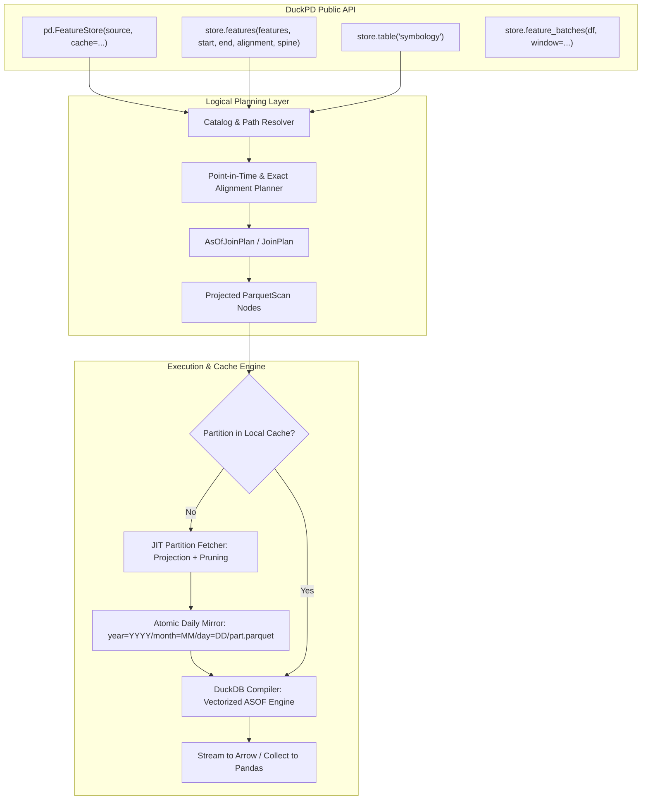

# Feature Store Architecture

**Status: implemented in DuckPD 0.1.4.**
This document describes the shipped architecture and its supported workflows.

---

## 1. Vision & Core Philosophy: The DuckPD Spirit

A feature store in DuckPD is not an orchestrator, an ingestion service, or a micro-daemon.
It is a **high-performance, point-in-time analytical retrieval engine** built for data scientists
and quantitative researchers working with massive, structured Parquet datasets.

### 1.1 Architecture
DuckPD unifies feature stores into its native relational plan architecture using three simple ideas:

1. **Partition-Mirrored Cache Layout (Zero Fragments, Zero Overlaps):**
   The local cache mirrors the native source layout. Production-style stores use
   one atomic Parquet file per UTC day, for example
   `ohlcv/year=2024/month=01/day=02/part.parquet`.
   - **Partition Pruning:** Exact queries fetch only intersecting days.
     Point-in-time queries additionally fetch the catalog-declared predecessor
     lookback.
   - **Column Projection:** Only requested columns are copied into each local
     daily partition.
   - **Standard Parquet:** The cache remains directly queryable by DuckDB,
     Polars, pandas, and other Parquet readers.
2. **Metadata-Only Setup:**
   Creating a `FeatureStore` validates `catalog.json`; remote construction may fetch that
   metadata. Building a feature selection creates an immutable logical plan without downloading
   feature partitions. Reference-table planning may read Parquet schema metadata.
3. **Transparent JIT Execution at Bounded Operations:**
   When users call `.collect()`, `.to_arrow()`, or stream training batches with
   `.to_arrow_batches()`, DuckPD ensures the required partition files are cached, compiles the
   native `ASOF` join, and streams rows directly from the local cache.
4. **First-Class Lazy `duckpd.DataFrame` Output:**
   `store.features(...)` and `store.table(...)` return ordinary lazy `duckpd.DataFrame` objects. Researchers can immediately use `.assign()`, filtering, `.groupby()`, and window operations.

The accepted [core contract](../decisions/0001-core-contract.md),
[order/index/session contract](../decisions/0002-order-index-session-contract.md),
and [architecture directives](../decisions/0003-directives-and-architecture.md)
remain authoritative:
- Preserve public signatures, behavior, ordering/index rules, execution
  boundaries, remote safeguards, and error behavior.
- Keep immutable logical plans as semantic state. DuckDB relations and generated
  SQL belong in the compiler.
- No automatic pandas fallback or Python row-by-row alignment. Do not promise
  zero copies or bounded memory for every join merely because output is streamed.
- Keep Python >=3.11, DuckDB >=1.5,<1.6, pandas >=3.0,<3.1, and PyArrow >=18.

**Non-goals:** online serving, feature computation/DAG execution, ingestion,
upload/catalog-authoring services, scheduling, distributed execution, an ML
framework API, or a new general-purpose storage format.

---

## 2. The Core Problem: Why Existing Approaches Fail at Scale

Large quantitative and event-driven feature datasets often span multiple terabytes across dozens of years and hundreds of indicator columns.

### 2.1 The Two Extremes That Do Not Work
1. **Downloading the Whole Dataset Upfront:**
   `aws s3 sync` or `hf_hub_download` for the entire dataset fails when the source exceeds local
   storage.
2. **Arbitrary Date Fragments:**
   Microsecond-range fragments require interval subtraction, mutable manifests, overlap
   reconciliation, and cross-process coordination. They also prevent the cache from remaining a
   directly queryable partitioned Parquet dataset.

### 2.2 The Partition-Mirrored Solution
Structured feature pipelines commonly publish one independently replaceable
file per family, timeframe, and UTC day:

```text
Remote Source:
store/
├── catalog.json
├── ohlcv/
│   └── year=2024/
│       └── month=01/
│           ├── day=01/part.parquet
│           ├── day=02/part.parquet
│           └── day=03/part.parquet
└── signals/
    └── year=2024/month=01/day=02/part.parquet
```

The prefix is catalog-defined and may instead include production dimensions
such as `family=ohlcv/timeframe=1m`. DuckPD interprets only the declared path
template; it does not hard-code dataset directory names.

When a researcher requests six minutes on 2024-01-02, exact alignment resolves
only `day=02`. Point-in-time alignment also needs observations preceding the
left boundary. A timeseries catalog may declare:

```json
{
  "partitioning": {
    "column": "datetime",
    "unit": "day",
    "timezone": "UTC"
  },
  "history_lookback": "P7D"
}
```

`history_lookback` is a publisher promise that this bounded interval contains
all predecessor state required at the query start. DuckPD prunes earlier
partitions. If the field is absent, DuckPD retains the conservative legacy
behavior and resolves complete history back to `min_time`.

### 2.3 Operational Advantages
- **1:1 File Mapping:** Every source day maps to one deterministic cache path.
- **Bounded Small Queries:** Minute-scale queries no longer project multi-GB
  annual files.
- **Schema-Bearing Empty Days:** Weekends and closures may have empty Parquet
  files, keeping date-path resolution deterministic.
- **Multi-Worker Safety:** Per-partition locks, unique temporary files, and
  atomic replacement prevent partial cache observations.
- **Zero Magic:** The local cache remains a standard partitioned Parquet
  dataset.

---

## 3. Developer Ergonomics & Target User Scenarios

To ensure great developer ergonomics, the API follows the **"Order what you need, let DuckPD manage the rest"** paradigm.

### Scenario 1: Training a Deep Learning Model (Streaming Arrow Batches)
A researcher training a neural network needs to stream feature batches over a multi-month period without ever loading the entire dataset into memory:

```python
from datetime import timedelta
import duckpd as pd

# 1. Connect to the store; construction may fetch catalog metadata, not feature partitions.
store = pd.FeatureStore(
    source="hf://datasets/hifinab/fdb",
    cache="~/.cache/fdb",  # Local partition mirror directory
)

# 2. Declare feature requirements and point-in-time alignment
training_data = store.features(
    features={
        "close": "ohlcv:close",
        "volume": "ohlcv:volume",
        "sma200": "signals:sma200",
    },
    start="2024-01-01T00:00:00Z",
    end="2024-06-01T00:00:00Z",
    filters={"ticker": ["AAPL", "MSFT", "NVDA"]},
    alignment="point_in_time",
    spine="ohlcv",
)

# 3. Apply standard DuckPD / pandas transformations lazily
features_df = training_data.assign(
    normalized_vol=lambda df: df["volume"] / df["volume"].rolling(30).mean()
)

# 4. Stream 30-day training batches directly as PyArrow tables
# Transparent JIT execution: DuckPD fetches missing partition columns on-the-fly,
# compiles the ASOF join, and streams rows directly to your model.
for batch_df in store.feature_batches(features_df, window=timedelta(days=30)):
    with batch_df.to_arrow_batches(batch_size=65_536) as reader:
        for arrow_batch in reader:
            torch_tensor = torch.from_arrow(arrow_batch)
            train_step(torch_tensor)
```

### Scenario 2: High-Speed Offline Research (Local-First Operation)
A quantitative researcher working offline on a train or in an air-gapped compute cluster points DuckPD directly at a local dataset directory.

```python
import duckpd as pd

# Point directly to any local directory matching the catalog structure
store = pd.FeatureStore(source="/mnt/nvme/market_data")

# Exact alignment: synchronous equi-join across datasets sharing the same clock
daily_features = store.features(
    features=["prices:open", "prices:high", "prices:low", "prices:close"],
    start="2023-01-01T00:00:00Z",
    end="2024-01-01T00:00:00Z",
    alignment="exact",
)

# Preview the first 10 rows instantly without scanning the whole dataset
preview = daily_features.sort_values(["datetime", "ticker"]).head(10)
print(preview)
```

### Scenario 3: Joining Categorical Reference Tables (Symbology / Metadata)
Feature stores frequently contain auxiliary reference tables (e.g., industry sectors, listing status, market hours) alongside time-series:

```python
import duckpd as pd

store = pd.FeatureStore(source="hf://datasets/hifinab/fdb", cache="~/.cache/fdb")

# 1. Get time-series features
features = store.features(
    features={"price": "ohlcv:close"},
    start="2024-01-01T00:00:00Z",
    end="2024-02-01T00:00:00Z",
    alignment="point_in_time",
    spine="ohlcv",
)

# 2. Get static reference table as a lazy DataFrame
symbology = store.table("symbology")  # columns: [ticker, sector, market_cap]

# 3. Join them seamlessly using standard DuckPD APIs
enriched = features.merge(symbology, on="ticker", how="left")
tech_stocks = enriched[enriched["sector"] == "Technology"]

# 4. Export directly to Parquet without ever converting to pandas
tech_stocks.write_parquet("tech_features.parquet")
```

### Scenario 4: Headless Cluster Batch Sync (Optional Explicit Preparation)
In production CI/CD or distributed compute clusters, an orchestrator (e.g., Airflow or Kubernetes Job) might want to pre-sync the exact cache partitions before training workers spawn:

```python
import duckpd as pd

store = pd.FeatureStore(source="hf://datasets/hifinab/fdb", cache="/shared/cache")

# Explicit preparation hook: downloads and projects partitions without executing queries
report = store.sync(
    features=["ohlcv:close", "signals:sma*"],
    start="2024-01-01T00:00:00Z",
    end="2025-01-01T00:00:00Z",
)
print(f"Synced {report.partitions_synced} partitions ({report.bytes_written / 1e6:.1f} MB)")
```

---

## 4. Architectural Design & Integration Points



### 4.1 Integration Components

1. **`duckpd.featurestore.FeatureStore`:**
   The public entry point. Holds the connection `Session`, resolved `catalog.json`, and cache configuration.
2. **Catalog v1 Specification:**
   Validates `catalog.json` at store initialization. Reads `timeseries` and `table` specifications, time columns, series keys, and feature definitions.
3. **Partition-Mirrored Cache Manager:**
   Resolves production UTC-day paths required by `[start, end)`. Point-in-time
   plans add optional `history_lookback` days. Missing or incomplete remote
   partitions are column-projected and atomically written to the corresponding
   daily cache path. Legacy yearly and monthly catalog templates remain readable
   for compatibility, but are not the publishing layout.
4. **Typed `AsOfJoinPlan` in DuckPD Core:**
   Adds native relational ASOF join representation to DuckPD's logical plan IR.
   - Equi-join keys: `series_keys` (e.g., `ticker`).
   - As-of inequality: `spine.datetime >= target.datetime + INTERVAL <delay> MICROSECOND`.
   - Direction: `backward` (latest available observation).
5. **DuckDB Compiler Integration:**
   Translates `AsOfJoinPlan` into DuckDB's native vectorized `ASOF JOIN` execution path.

---

## 5. Temporal Alignment & Point-in-Time Correctness

### 5.1 The Explicit Spine Contract
Point-in-time alignment requires an explicit `spine` parameter (for example,
`spine="ohlcv"`). The spine dataset provides the definitive clock and entity
universe for `[start, end)`, and every spine row is preserved by an
`ASOF LEFT JOIN`.

### 5.2 Availability Delay & Lookahead Protection
To prevent data leakage during backtesting and training:
- Each feature in `catalog.json` specifies an ISO 8601 `availability_delay` (e.g., `PT1M` for 1-minute close prices, `PT0S` for open prices, `PT2H` for fundamental updates).
- In point-in-time mode, DuckPD guarantees that an observation is only visible to the model after `observation_time + delay`.
- Features missing `availability_delay` or marked `lookahead_safe: false` fail fast during planning.

### 5.3 Sparse History & Predecessors
If a technical indicator or economic signal updates infrequently, the catalog
publisher must choose a `history_lookback` long enough to include the latest
eligible predecessor at any query boundary. DuckPD uses that duration only to
bound partition discovery; it does not manufacture or forward-fill values.
Omitting the declaration preserves complete-history resolution for sparse
datasets whose predecessor horizon cannot be bounded safely.

---

## 6. Implemented Components

DuckPD 0.1.4 ships the complete feature-store path described above:

- local cataloged Parquet stores and validated Catalog v1 metadata;
- exact alignment through ordinary lazy join plans;
- point-in-time alignment through typed `AsOfJoinPlan` nodes and DuckDB native
  `ASOF LEFT JOIN`;
- local, Hugging Face, and HTTP(S) sources;
- production daily partition pruning with optional bounded point-in-time
  predecessor history;
- read compatibility for legacy yearly and monthly catalog templates;
- cumulative column-projected daily remote caches with per-partition
  coordination, unique staging files, and atomic replacement;
- lazy `store.table()`, `store.features()`, and `store.feature_batches()` APIs;
- explicit cache pre-warming through `store.sync()`;
- an end-to-end notebook and a cold-versus-warm FeatureStore benchmark.

The public behavior and intentional exclusions are maintained in
[`COMPATIBILITY.md`](../COMPATIBILITY.md). Release history is maintained in
[`CHANGELOG.md`](../CHANGELOG.md).
