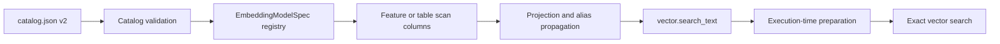

# Feature Store Embedding Metadata and Automatic Model Preparation

**Status: proposed.**

## Product decision

A feature-store catalog may declare that a feature or table column contains text
embeddings and identify the immutable model specification that produced them.
DuckPD propagates that declaration into the existing `EmbeddingColumnSpec`
metadata used by `DataFrame.vector.search_text()`.

When a text query is executed against such a column, DuckPD may automatically
prepare the declared local embedding model if it is not already available. Model
preparation remains an execution-time side effect: constructing a
`FeatureStore`, reading `catalog.json`, selecting features, calling
`vector.search_text()`, or inspecting `explain()` must not download model
artifacts.

Automatic preparation is enabled by default for catalog-declared local models
and can be disabled at the session or feature-store boundary. It never selects a
model based only on vector dimension, never silently switches providers, and
never sends text to a remote service.

## Goals

- Describe embedding columns and their complete model identity in
  `catalog.json`.
- Make catalog-loaded embedding metadata behave like metadata restored from a
  DuckPD Parquet embedding sidecar.
- Allow text search without repeating the model specification at every call.
- Prepare a missing local model exactly when query inference begins.
- Reuse DuckPD's model fingerprint, cache verification, and vector compatibility
  checks.
- Preserve lazy planning, offline operation, deterministic model identity, and
  actionable failures.
- Support embedding columns in both timeseries features and reference tables.

## Non-goals

- Generating or refreshing stored corpus embeddings.
- Inferring a model from vector values, dimensions, column names, or dataset
  descriptions.
- Automatically creating HNSW indexes or changing exact-search semantics.
- Automatically installing the optional `duckpd[embeddings]` dependency.
- Allowing mutable model revisions such as `main` or `latest`.
- Falling back from a local backend to a hosted provider.
- Defining credentials or arbitrary executable provider configuration in a
  catalog.
- Treating the catalog as proof that the stored vectors were generated by the
  declared model; publishers remain responsible for catalog correctness.

## Catalog schema

This proposal introduces catalog version 2. Version 1 remains readable and has
no embedding declarations. Writers must emit version 2 when using the new
fields.

Models are defined once in a top-level `embedding_models` mapping. Embedding
columns reference a model by name so large catalogs do not duplicate model
specifications.

```json
{
  "catalog_version": 2,
  "embedding_models": {
    "bge-small-en-v1.5": {
      "model": "BAAI/bge-small-en-v1.5",
      "revision": "5c38ec7c405ec4b44b94cc5a9bb96e735b38267a",
      "dimension": 384,
      "backend": "fastembed",
      "normalize": true,
      "pooling": "model-default",
      "document_prefix": "",
      "query_prefix": ""
    }
  },
  "datasets": [
    {
      "name": "news",
      "kind": "timeseries",
      "time_column": "published_at",
      "series_keys": ["document_id"],
      "partitioning": {
        "column": "published_at",
        "timezone": "UTC",
        "unit": "year"
      }
    },
    {
      "name": "companies",
      "kind": "table",
      "columns": {
        "description_embedding": {
          "embedding_model": "bge-small-en-v1.5"
        }
      }
    }
  ],
  "features": {
    "news:embedding": {
      "dataset": "news",
      "name": "embedding",
      "availability_delay": "PT0S",
      "lookahead_safe": true,
      "embedding_model": "bge-small-en-v1.5"
    }
  }
}
```

The fields inside each model definition deliberately match
`EmbeddingModelSpec`. The stable model fingerprint is computed from the parsed
specification and is not supplied independently by catalog authors. This avoids
accepting a fingerprint that disagrees with its inputs.

For timeseries datasets, embedding metadata belongs on the existing feature
entry because feature selection and aliasing are defined there. For table
datasets, optional `columns` metadata belongs on the dataset entry because
reference-table columns do not have feature entries. A column declaration is
metadata only; physical names and types still come from the Parquet schema.

The first release accepts only `backend: "fastembed"` in a portable catalog.
A future custom or hosted backend requires a separately designed, explicitly
registered trust policy. Catalog values must never import Python objects,
contain credentials, or select arbitrary code.

### Validation

Catalog validation must fail eagerly when:

- an embedding model key or model identifier is empty;
- a revision is absent or mutable;
- dimension is not a positive integer;
- a backend or model field is unsupported;
- an `embedding_model` reference is unknown;
- table `columns` metadata names a column absent from the inspected Parquet
  schema;
- the physical column is not a fixed-size numeric array;
- the physical array dimension differs from the declared model dimension;
- one output column receives conflicting embedding declarations.

Model definitions that are not referenced are allowed so catalogs can share a
standard registry across dataset revisions. Unknown fields remain rejected
inside model definitions to catch misspellings that would otherwise alter model
semantics.

## Public API

Catalog metadata makes the model argument optional for persisted text search:

```python
store = pd.FeatureStore(
    source="hf://datasets/example/embedded-news",
    cache="~/.cache/embedded-news",
)

news = store.features(
    features=["news:embedding"],
    start="2025-01-01T00:00:00Z",
    end="2026-01-01T00:00:00Z",
    alignment="exact",
)

matches = news.vector.search_text(
    "central bank policy and inflation",
    column="embedding",
    k=20,
    tie_breaker="document_id",
)
```

`VectorFrameMethods.search_text(..., model=None)` resolves the model from the
selected column's `EmbeddingColumnSpec`. Existing calls that pass `model=` keep
working. An explicit model must have the same fingerprint as the column
metadata; it is a compatibility assertion, not an override.

Raw-vector `vector.search()` does not require or prepare a model because it does
no query-text inference.

Automatic preparation is controlled explicitly:

```python
store = pd.FeatureStore(
    source="hf://datasets/example/embedded-news",
    cache="~/.cache/embedded-news",
    auto_prepare_embeddings=False,
)
```

With automatic preparation disabled, execution raises the existing actionable
error and the caller can prepare ahead of time:

```python
model = store.embedding_model("bge-small-en-v1.5")
store.session.prepare_embedding_model(model)
```

`FeatureStore.embedding_model(name)` returns the validated immutable
`EmbeddingModelSpec` without downloading anything. This supports offline
preparation, deployment warm-up, inspection, and reproducible logging.

The session should own the effective preparation policy because model providers
and prepared artifacts are session-owned. `FeatureStore` configures that policy
for models originating from its catalog without changing the behavior of
unrelated frames in the same session. If multiple stores share a session, each
catalog model registration carries its own allow-auto-prepare flag; a conflict
for the same fingerprint uses the stricter policy and is reported.

## Metadata propagation

Catalog parsing produces validated `EmbeddingModelSpec` instances and resolves
feature or table column declarations to `EmbeddingColumnSpec`.



The following implementation points are required:

1. `_feature_catalog.validate_catalog()` validates versions 1 and 2 and returns
   or constructs the model registry in addition to dataset and feature indexes.
2. `FeatureStore._timeseries_frame()` attaches the resolved embedding metadata
   to physical feature columns when it builds scan metadata.
3. `FeatureStore._inspect_table_columns()` applies validated dataset `columns`
   declarations after inspecting the Parquet schema.
4. `FeatureStore._project_feature_outputs()` copies the source column's
   `embedding` field when creating an aliased output column.
5. Existing projection, rename, filtering, alignment, and join metadata rules
   preserve or clear embedding identity exactly as they do for embeddings read
   from sidecar manifests.

A point-in-time or exact alignment must not change embedding identity. If the
same physical feature is selected under two aliases, both outputs carry the same
immutable specification.

## Preparation lifecycle

Planning remains side-effect free. `search_text()` registers the redacted query
and builds a `SemanticSearchPlan`, but does not contact a model registry or
filesystem beyond existing catalog access.

At execution, immediately before the first query embedding call:

1. Resolve the provider by model fingerprint from the owning session.
2. If it is already prepared, reuse it.
3. If a compatible provider is registered but unprepared, call its `prepare()`
   only when the catalog registration permits automatic preparation.
4. Otherwise create the existing `FastEmbedProvider` and call
   `Session.prepare_embedding_model()` using the session embedding cache.
5. Verify the prepared provider fingerprint and artifact manifest.
6. Embed the query and execute the existing exact vector-search path.

Preparation must be idempotent within a session. Cross-process behavior relies
on the embedding cache's atomic staging and verified manifest contract; the
implementation must add a per-fingerprint lock if concurrent preparation can
currently race before atomic promotion.

Model preparation occurs before scanning feature partitions where practical, so
a dependency, network, digest, or model-availability failure does not trigger a
large data download first. Feature partition caching and model caching remain
separate concerns with separate paths and metrics.

`explain()` reports the model fingerprint, backend, whether automatic
preparation is allowed, and current prepared state, but never downloads the
model. `profile()` records automatic preparation separately from query inference
and feature-partition transfer.

## Offline, security, and trust behavior

Automatic download is convenient but changes the supply-chain boundary. The
following constraints are mandatory:

- catalogs require immutable model revisions;
- existing artifact digest verification and atomic cache promotion remain in
  force;
- only reviewed local backends may be automatically instantiated;
- remote providers and transmission of query text require explicit application
  registration and are never activated by catalog content;
- catalog parsing never imports provider modules or executes catalog-defined
  code;
- errors identify the model key, backend, and remediation without exposing
  local credentials or query text;
- `auto_prepare_embeddings=False` provides a deterministic offline and
  air-gapped mode.

A stronger future catalog may publish an expected artifact digest. That should
be added only after backend artifact layout and digest stability are qualified;
a revision and DuckPD's post-download cache digest are the initial contract.

## Failure semantics

Failures are early and specific:

| Condition | Behavior |
| --- | --- |
| Missing column embedding metadata and omitted `model` | Reject during `search_text()` planning. |
| Explicit model fingerprint mismatch | Reject during planning. |
| Catalog dimension differs from Parquet type | Reject when schema metadata is inspected, before row scanning. |
| Automatic preparation disabled and model unavailable | Reject at execution before feature partition scanning. |
| Optional FastEmbed dependency missing | Raise `UnsupportedOperationError` with the extra to install. |
| Download, digest, or cache promotion failure | Abort execution; do not produce search results or a partial verified cache. |
| Prepared provider returns a mismatched fingerprint or vector shape | Abort before distance calculation. |

No fallback to raw string search, a different model, post-filtering, or an
unverified same-dimension vector space is permitted.

## Compatibility and rollout

### Phase 1: catalog metadata

- Add catalog version 2 and parse the top-level model registry.
- Preserve version 1 behavior unchanged.
- Attach model metadata to timeseries features and table columns.
- Preserve metadata through feature aliases and alignment.
- Add catalog inspection through `FeatureStore.embedding_model()`.

### Phase 2: inferred model API

- Make `model` optional in `vector.search_text()`.
- Resolve omitted models only from verified column metadata.
- Keep explicit model calls source compatible and fingerprint checked.
- Extend `explain()` with model origin (`catalog`, `sidecar`, or `explicit`).

### Phase 3: execution-time automatic preparation

- Add scoped preparation policy and execution hook.
- Ensure preparation precedes feature partition reads.
- Qualify concurrent preparation and failure cleanup.
- Record preparation timing and cache reuse in profiles.

### Phase 4: authoring and documentation

- Add a catalog-generation helper that serializes an
  `EmbeddingModelSpec` without duplicating fingerprint logic.
- Update the feature-store walkthrough with local, remote, pre-warmed, and
  offline examples.
- Publish a version 1 to version 2 migration example.

## Testing and qualification

Permanent tests should cover:

- version 1 catalogs retain existing behavior;
- valid version 2 timeseries and table declarations attach the expected model
  fingerprint and fixed-size vector type;
- malformed model specs, unknown references, unsupported backends, missing
  columns, and dimension mismatches fail with stable messages;
- aliases, projections, filters, exact alignment, and point-in-time alignment
  preserve embedding metadata;
- `search_text()` infers the catalog model when omitted and rejects mismatches;
- constructing a store, selecting features, and calling `explain()` perform no
  model preparation or download;
- first execution prepares once, while later searches and stores sharing a
  session reuse the verified provider;
- disabled automatic preparation works offline and retains the explicit
  preparation workflow;
- preparation failure occurs before partition transfer and leaves no promoted
  partial cache;
- concurrent processes converge on one verified model cache;
- query text, credentials, and local secrets remain absent from explain,
  profile, and errors;
- raw-vector search never prepares a model;
- exact search results match the existing explicit-model API.

Qualification should include a remote feature catalog with uncached partitions,
a cold model cache, a warm model cache, and an air-gapped run. Metrics should
separate catalog fetch, model preparation, feature transfer, query inference,
and vector search so the automatic behavior remains observable rather than
hidden.

## Open decisions

1. Whether the preparation policy should also be exposed directly on
   `Session`, and how store-scoped policy composes when callers inject a shared
   session.
2. Whether catalog version 2 should reject all unknown model fields or preserve
   extension fields under a dedicated `metadata` object.
3. Whether model preparation needs an explicit timeout and download-size limit
   before automatic preparation ships enabled by default.
4. Whether `FeatureStore.embedding_models()` should expose all definitions in
   addition to singular lookup.
5. Whether an expected artifact digest can be made portable across supported
   FastEmbed versions and operating systems.
