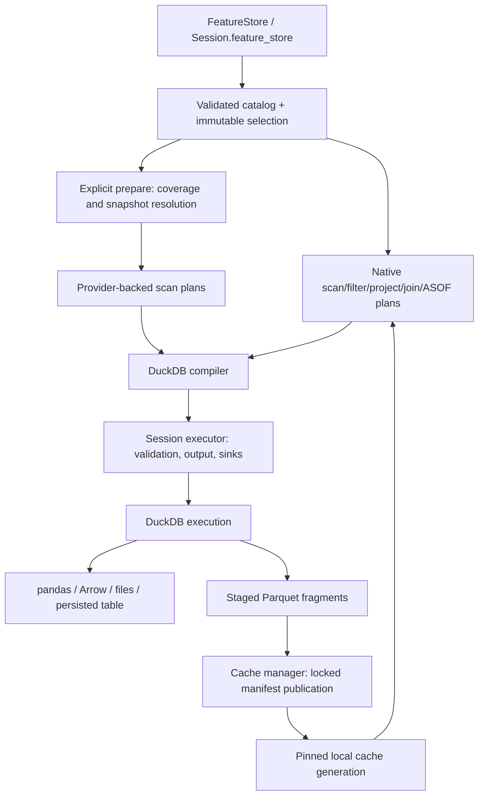

# Feature Store Implementation Roadmap: Adapting pymfs to DuckPD

**Status: proposed; no feature-store implementation is claimed by this document.**
Reviewed against the local `pymfs` 0.1.5 and DuckPD 0.1.3 sources on 2026-09-05.
All new APIs and modules below are implementation targets, not existing APIs.

## 1. Scope and non-negotiable constraints

Add an embedded, read-only, offline feature-retrieval layer over cataloged Parquet
data. Adapt selected `pymfs` semantics, not its connection wrapper or entire project.
Feature retrieval must return ordinary lazy `duckpd.DataFrame` objects, composed
with DuckPD's existing filters, projections, joins, aggregation, and output paths.

The accepted [core contract](../decisions/0001-core-contract.md),
[order/index/session contract](../decisions/0002-order-index-session-contract.md),
and [architecture directives](../decisions/0003-directives-and-architecture.md)
remain authoritative:

- Preserve existing public signatures, behavior, ordering/index rules, execution
  boundaries, remote safeguards, and error behavior outside the new feature.
- Keep immutable logical plans as semantic state. DuckDB relations and generated
  SQL belong in the compiler; do not wrap an eager upstream store in a DataFrame.
- No automatic pandas fallback or Python row-by-row alignment. Do not promise
  zero copies or bounded memory for every join merely because output is streamed.
- Keep Python >=3.11, DuckDB >=1.5,<1.6, pandas >=3.0,<3.1, and PyArrow >=18.
  Do not inherit upstream's higher minimums or its unrelated dependencies.
- Separate metadata resolution, cache preparation, and result execution. No
  constructor-time data downloads, table snapshots, or result materialization.
- Upstream source directories are research inputs only: no runtime dependency on
  `.temp/`, vendored monolith, or new dependency on `pymfs` itself.

**Non-goals:** online serving, feature computation/DAG execution, ingestion,
upload/catalog-authoring services, scheduling, distributed execution, an ML
framework API, or a new general-purpose storage format. Revision-aware/bitemporal
training joins, caller-supplied observation DataFrames, arbitrary catalog URI
schemes, and a general public `merge_asof()` API are separate follow-up work.

## 2. Findings from the source review

### 2.1 What is actually reusable

The main implementation is `.temp/pymfs-main/src/pymfs/__init__.py`. Supporting
evidence is its `README.md`, `tests/test_pymfs.py`, `demo/build_catalog.py`,
`pyproject.toml`, and `LICENSE`.

| Source behavior / location | Adaptation |
| --- | --- |
| `_load_catalog()`, `_dataset_path_template()` | Catalog v1 conventions: `timeseries` and `table` datasets, relative Parquet paths, optional metadata documents, `{year}` templates. Validation is embedded in `FeatureStore`; there is no standalone `Catalog` class to port. |
| `_resolve_features()` | Canonical `dataset:feature` references, unambiguous short names, ordered `dataset:*` expansion, alias mappings, and duplicate-output rejection. |
| `parse_timestamp()`, `parse_availability_delay()` | Aware ISO timestamps normalized to UTC; non-negative, calendar-independent availability durations. |
| `_missing_intervals()`, `_merge_intervals()`, `_covers_filters()` | Half-open coverage arithmetic and conservative containment of conjunctive string-valued `IN` filters. These are useful algorithms, not proof of a complete cache design. |
| `_relation()` | Exact inner alignment and backward ASOF matching grouped by `(dataset, availability_delay)`, allowing different delays within one dataset. |
| `features()`, `feature_batches()` | Narrowing a fixed selection and iterating consecutive output-time windows. Upstream returns DuckDB relations; DuckPD should return native frames. |

Source dispatch supports local directories and `hf://datasets/...` /
`hf://buckets/...`. The README's broader S3 claim is not implemented by that
dispatch. There is no asynchronous execution API: these are differently sampled
time series, not asynchronous Python operations. `huggingface_hub` is imported at
module import time; `datasets` is optional, not a core runtime import.

The persistent cache has projected time-series fragments and full reference-table
snapshots. DuckDB's internal caches are separate; upstream's `disable_cache` toggles
those internal caches, not persistent fragment reuse.

### 2.2 Behavior that must not be ported unchanged

1. **Eager construction.** `_cache_tables()` loads/registers all catalog tables;
   a remote cache downloads every table in full. `_configure_features()` fetches
   missing feature data and creates a view or materialized table. Strict PIT
   metadata validation can occur after these writes.
2. **Implicit spine.** PIT uses the first selected dataset's event rows. Changing
   feature order can therefore change result rows. Require an explicit spine in
   DuckPD rather than silently importing this behavior.
3. **Insufficient PIT history.** Reading only from `start - maximum_delay` drops
   eligible sparse predecessors. A 09:00 observation with a one-minute delay is
   eligible at 10:00 but absent from a scan starting at 09:59. Zero-delay features
   need predecessor history too. See section 4.3.
4. **Unsafe fragment reconciliation.** Multiple fragments are combined using
   `union_by_name` and `MAX(feature)` per key. This can hide duplicate keys,
   conflicting versions, and genuine nulls; it is not a general merge policy.
5. **Weak cache identity/publication.** Manifest entries lack source revision and
   catalog identity. Atomic renames alone do not prevent concurrent writers from
   losing manifest updates. Schema and coverage integrity need stronger checks.
6. **Overstated safety/offline guarantees.** `lookahead_safe` is producer metadata,
   not verification of causal computation. Missing local catalog metadata can
   fall through to remote handling. Neither behavior is an acceptable guarantee.

Upstream tests are useful fixtures for supported selection and dense alignment
cases, not an oracle for these defects. Retain the upstream MIT copyright and
permission notice wherever code or substantial test material is copied/adapted.

## 3. Target surface and compatibility decisions

### 3.1 Proposed public API

| Surface | Contract |
| --- | --- |
| `duckpd.FeatureStore(..., session=None)` | Validates and captures a fixed selection; may resolve catalog/schema metadata. Never populates the cache or scans result rows during construction. |
| `Session.feature_store(...)` | Convenience factory using that session, equivalent to passing `session=`. Add only once the implementation is usable. |
| `store.catalog()` | Defensive catalog copy/read-only discovery; caller mutation cannot alter the selection. |
| `store.features(start=None, end=None, columns=None, order_by=None)` | Lazy DataFrame for the configured selection or a narrower subrange/projection. Missing required cache coverage raises; it does not trigger a download. |
| `store.table(name)` | Lazy reference-table DataFrame. No automatic join with selected features, global SQL registration, or eager loading of unrelated tables. |
| `store.feature_batches(window=timedelta(...), ...)` | Iterator of lazy frames over adjacent half-open output windows. Uses the same snapshot/history as whole-range retrieval. |
| `store.prepare(tables=...)` | **Explicit I/O boundary.** Populate missing configured feature coverage and only named reference-table snapshots; return a new cache-backed store pinned to the published manifest generation. Do not mutate existing frames. |

Retain constructor concepts `source`, `cache`, `token`, `catalog_path`, `features`,
`start`, `end`, `filters`, and `alignment`. Add `session` and an explicit `spine`
dataset name for PIT. An optional remote `revision` selector must resolve to a
concrete source identity before data preparation; it must not mean a mutable
branch name inside an already-created plan.

- Provide `features`, `start`, and `end` together, or omit all three for table-only
  access. A selection requires an explicit alignment. Filters require a selection.
- PIT requires `spine`; exact alignment rejects it. The spine may be a catalog
  time-series dataset without a selected feature, so cache its keys/time as well.
- Remote selections require a local cache in the first release. A cold selection
  needs explicit `prepare()` before `features()`; adequate warm coverage can be
  pinned without downloading. Preparing a table-only store is supported.
- Local authoritative stores can be scanned directly. For offline cache access,
  open the cache directory as `source`; never fall back to network resolution.
- `prepare()` defaults to the configured feature selection and no tables. A
  local authoritative store does not require it; without a cache destination it
  must fail with an actionable message rather than creating an implicit cache.
- Selection, aliases, filter scope, source identity, and chosen manifest generation
  are immutable. Refresh means a new store/snapshot, not invalidation of old plans.

Do not add `store["name"]`, raw `connection()`/`query()` wrappers, public parsing
utilities, or an `inmemory` constructor flag merely to mirror upstream. Use native
frame operations and the existing explicit `.persist()` boundary instead.
Persistence creates a session table; it is not a guarantee of RAM-only storage.

### 3.2 Adoption boundary

First deliver local catalog access, exact alignment, then correctly specified PIT.
Add persistent coverage caching and optional Hugging Face access only after those
semantics are tested. Hugging Face datasets are the initial remote target; buckets
are conditional on tested SDK support and a defensible snapshot-identity contract.

Catalog v1 compatibility does **not** imply drop-in Python API compatibility or
binary compatibility with `pymfs` cache manifests. Define a DuckPD-specific manifest
format/version. Reject upstream/unrecognized manifests with migration guidance;
rebuild from an authoritative source initially. Offline legacy-cache migration is
deferred rather than inventing missing provenance/history evidence.

## 4. Data and alignment contracts

### 4.1 Catalog, paths, timestamps, and filters

- Validate dataset/feature structures, unique names, nonempty column names,
  dataset references, supported versions, and alias collisions before execution.
  Reject column collisions under DuckDB identifier comparison rules, including
  aliases colliding with time/entity keys. Preserve catalog wildcard order.
- Require compatible time-column names, ordered entity-key lists, and physical key
  types across selected datasets and the spine. Empty entity-key lists represent a
  single global time series. Do not coerce numeric/string keys implicitly.
- Resolve paths relative to the source root; allow only supported template fields.
  Reject absolute paths, traversal/symlink escapes, embedded credentials, arbitrary
  external URIs, and executable SQL in catalog fields. Use existing quoting and
  typed literals rather than concatenating user values into SQL.
- Validate physical schemas using Parquet metadata. Resolve `path_template` from
  the catalog or its referenced metadata document; do not guess a layout when
  metadata is missing. Pin/cache required detailed metadata too.
- Require aware time columns and aware ISO input bounds. Normalize instants to UTC;
  reject naive/date-only bounds and `end <= start`. Define the first contract at
  microsecond precision, rejecting unsupported precision loss or duration overflow
  instead of rounding silently. Do not modify a shared session's timezone.
- Support non-negative day/hour/minute/second availability delays, including zero;
  reject calendar years/months. `min_time` / inclusive `max_time` are pruning hints,
  not evidence of continuous coverage. Handle partition boundaries and timestamp
  overflow explicitly; missing expected files are errors, not empty partitions.
- Initially restrict filters to common entity keys with nonempty string sequences,
  preserving values such as `"001"`. Normalize duplicates/order for cache identity.
  This avoids upstream's loss of non-key predicate columns in projected fragments.
  Apply entity filters before alignment; filter feature values afterward using
  DataFrame expressions. General typed predicates can be added separately.

### 4.2 Keys, exact alignment, and output metadata

Time-series `(time_column, *series_keys)` must be unique and non-null within the
relevant source scope. Reject duplicates/null keys rather than multiplying rows or
selecting an arbitrary ASOF tie. Structural checks are immediate; data-dependent
checks execute through the executor at preparation/result boundaries, before any
result batch is returned. Their scan cost must be visible and may be amortized
only by snapshot-bound validation evidence.

Exact alignment is an **inner join** on all declared time/entity keys and ignores
availability delays deliberately. Reuse native `merge()` / `JoinPlan`, with the
feature-store validation above. DuckPD equijoins have pandas-style null matching;
rejecting feature-store null keys avoids changing that existing core behavior.

Return time and entity keys followed by requested output aliases, in selection
order. Preserve physical value dtypes/nulls; absence must not become zero. Reference
tables may have no key; a declared primary key is validated when relied upon.
Reference-table snapshots are not historical PIT tables.

Feature-store joins do not imply an index or a total output order. Hide internal
availability/helper columns and do not inherit a physical file ordinal as an
aligned-row identity. Users request `order_by` or `.sort_values(...)` for ordered
previews, positional operations, or windows. Existing `.head()` order requirements
still apply; `.limit()` remains lazy.

### 4.3 Point-in-time alignment: availability, spine, and history

For each declared spine row with time `t` and entity keys `k`, select the latest
source event `s` with matching keys and `s.time + feature.delay <= t`. Matching is
backward, allows equality, and preserves every spine row with nulls for no match.
Join separately per `(dataset, delay)` group, including the spine dataset's own
delayed features. A latest matching row containing a null remains null: do not
search backward for the last non-null value.

- The explicit spine supplies event-time/key rows in `[start, end)`. Reordering
  feature references must not change row membership. Initial spine selection is
  a dataset name, not an arbitrary SQL expression or inference from feature order.
- Require `lookahead_safe is True` and valid delay metadata on every selected
  feature before preparation. These assert producer intent; they cannot prove
  that a feature was computed without future information.
- **Correctness-first history baseline:** include all potentially eligible source
  history in the pinned snapshot, not just `start - max(delay)`. The spine itself
  is output-range restricted; right-side history is not restricted to that lower
  bound. Prune only partitions proven ineligible, including future observations.
- This can require substantial historical reads/downloads. A later optimization
  may retrieve a proven last eligible predecessor per entity/delay group plus
  subsequent observations. It must prove predecessor completeness or absence,
  including irregular, overnight, weekend, and cross-year gaps. Unknown history
  is an error, not a null result. Do not infer a staleness horizon from delay.
- Narrowing a requested range or batching must preserve this history. A time filter
  on the output spine must not be pushed to both sides of an ASOF join. Value
  predicates on the right side are not generally safe to push below alignment.

The promise is **availability-delay-aware alignment under trusted metadata and a
pinned source snapshot**, not “zero lookahead bias.” Later revisions/backfills,
unrecorded publication times, and joins to current reference data can still leak
future information. Bitemporal/release-history semantics are explicitly deferred.

## 5. Native architecture and integration points

### 5.1 Reuse existing layers, add only missing primitives

| DuckPD location / current fact | Planned integration |
| --- | --- |
| `io._get_implicit_session()` uses a weak context-local reference; each `Session` owns one connection, not a pool | Retain the chosen session strongly in stores/frames. Prefer explicit sessions for resource ownership. |
| `Session.read_parquet()` supports local, HTTP(S), S3, GCS/GS; it rejects `hf://` | Returned feature frames use native local/cache Parquet scans initially. Add a narrow provider-aware scan path for preparation; filesystem registration alone does not bypass the current allowlist. |
| `ScanPlan`, `FilterPlan`, `ProjectPlan`, `JoinPlan`, `UnionPlan`, `_metadata.py` | Reuse these for selection, exact joins, and cache reconstruction wherever their semantics apply. Carry read-only feature provenance without changing ordinary reader behavior. |
| No native ASOF plan/compiler support; Narwhals `join_asof` raises unsupported | Add a narrowly scoped typed `AsOfJoinPlan` and compiler support. Do not claim general pandas/Narwhals ASOF compatibility. |
| `_compiler.py` owns DuckDB relation construction | Generate ASOF SQL/expressions here with validated bindings. The feature module builds plans, not executable SQL or stored relations. |
| `_executor.py` owns output, validation, reporting, and sinks | Route scans, validation, cache writes, streaming, and persistence through existing execution boundaries or explicit executor-owned preparation helpers. |
| `DataFrame` supports boolean indexing, `.to_arrow()`, `.to_arrow_batches()`, `.persist()` | Use those names. `.filter()`, `.to_arrow_table()`, and `duckpd.Timedelta` are not DuckPD APIs. |

Do not use temporary aligned views / generic `TableSource` as the normal bridge.
They hide source structure from DuckPD planning, introduce mutable catalog/lifetime
dependencies, and can inherit writable provenance. `Session.sql()` remains a
user escape hatch, not the implementation strategy for native feature alignment.



Suggested internal split, not a new public abstraction hierarchy:

- `src/duckpd/featurestore.py`: public facade, validation orchestration, session binding.
- `_feature_catalog.py`: immutable catalog/selection models and reference resolution.
- `_feature_alignment.py`: native plan construction and history requirements.
- `_feature_cache.py`: coverage, immutable fragments, manifest publication and integrity.
- `_feature_sources.py`: local/HF metadata and preparation adapters; lazy optional imports.

Keep parsers and catalog models private initially. Add `FeatureStore` to top-level
exports only with a tested end-to-end capability, not an unusable public stub.

### 5.2 Cross-cutting obligations for new plans

Adding an ASOF dataclass and compiler branch is insufficient. Audit and update:

- `LogicalPlan` unions, compiler dispatch/bindings, type/nullability propagation,
  hidden column handling, metadata transitions, and child traversal.
- Optimizer tree rewrites, column liveness, common-subplan detection, serialization,
  explain output, and idempotence. Start ASOF as a conservative optimization barrier;
  enable pushdowns only after equivalence tests prove them safe.
- Executor `_plan_nodes()`, `_validate_execution()`, dtype derivation, source/movement
  reporting, bounded-materialization analysis, `explain_write()`, and commit walkers.
  Nested joins must not bypass remote limits, validation, or read-only protections.
- Feature/cache provenance must include sanitized source/snapshot identity and remain
  read-only through supported transformations, even for a single selected Parquet
  source. `.commit()` must not overwrite source data or cache fragments. Explicit
  writes/persistence to a new destination remain allowed under existing contracts.

A new provider scan descriptor needs the same audit for source inspection,
capabilities, serialization, redaction, and cleanup. Keep HF-specific behavior out
of generic DataFrame methods; do not loosen existing remote credential checks.

### 5.3 Session ownership and execution visibility

`Session` currently configures memory, threads, temporary storage, and insertion
order, but does not explicitly set UTC or expose a generic filesystem-registration
API. Add only the private, session-owned provider lifecycle needed for preparation.
Do not copy upstream's global timezone/cache/progress settings. Reject conflicting
credentials for the same provider in one session; require a separate explicit
session rather than silently replacing a filesystem used by existing plans.

Stores must not close a borrowed or shared implicit session. Closing a session
invalidates dependent frames normally. Deleting a store must not drop resources
still used by its frames/readers; retained sessions and pinned cache generations
must outlive lazy execution and batch consumption. Avoid global `features` or
dataset-name view registrations entirely.

Distinguish three boundaries:

1. **Planning:** argument validation, catalog discovery, and Parquet schema/footer
   access may perform metadata I/O, as existing readers do. No row materialization,
   cache-directory writes, or hidden `prepare()` calls.
2. **Preparation:** explicit remote reads, data validation, Parquet writes, and
   manifest publication; report cache hits/misses, required history, scanned/written
   bytes where measurable, and snapshot identity without credentials.
3. **Execution:** `.collect()`, `.to_arrow()`, `.to_arrow_batches()`, ordered `.head()`,
   direct sinks, and `.persist()` use normal executor behavior. Time-window batching
   is distinct from row-batch streaming and does not prove bounded upstream memory.

`explain("logical"|"optimized"|"json")` is plan-only; SQL/physical/default explain
can compile and inspect source metadata, and `explain("analyze")` executes.
No non-analyzing explain may prepare caches. `execution_count` alone is not proof
of no I/O; tests must observe filesystem/provider calls too. Do not broaden
`collect_small()` claims to joins outside its existing supported bounded subset.

## 6. Cache, offline, and provider strategy

### 6.1 Snapshot identity and coverage

Define the manifest contract before implementing cache writes. Each cache namespace
must bind a canonical credential-free source identity, resolved revision/object
inventory, catalog and schema fingerprints, and its own manifest format version.
Each published generation references immutable fragment IDs, relative paths,
integrity metadata, dataset/column presence, entity-filter scope, covered intervals,
and any validated key/history evidence. Record table snapshots separately.

- Catalog versions are schema versions, not data revisions. A source label or SQL
  hash is not sufficient snapshot identity. Never mix fragments from different
  repositories, revisions, schemas, or incompatible catalogs.
- Use immutable remote revisions where available. For mutable/local sources,
  record an inventory and detect changes during reads/preparation; fail on detected
  mutation. Strong reproducibility requires an immutable or retained prepared
  snapshot, not merely paths or mtimes. Reject unsupported snapshot guarantees.
- Coverage means all relevant source rows for the recorded scope were successfully
  read, including successful empty scans. Missing/corrupt files and incomplete
  reads never count as empty coverage. Store enough schema for typed empty results
  without probing an uncached remote partition.
- Reuse a fragment only if its columns, time coverage, snapshot, and filter scope
  cover the request. Initially use conservative per-fragment filter containment;
  do not claim that separate entity subsets cover their union without implementing
  and testing that coverage algebra.
- PIT coverage includes the separate spine key scan and complete eligible history
  (or future proven predecessor evidence), not merely the output interval. Offline
  access must distinguish known no predecessor from missing historical coverage.

### 6.2 Reconstruction, publication, and offline behavior

Do not reconcile overlaps with `MAX()`. Choose one authoritative covering fragment
per feature/key/time/filter region from the pinned snapshot; reconstruct column
subsets using native key joins with explicit column-presence metadata. A genuine
null differs from an absent column. Conflicting overlapping values/duplicate source
keys are errors, not an implicit “latest” or “largest” policy. Test cold/warm/offline
equivalence independent of fragment order and count.

Preparation should use native projected/filter scan plans and
`.write_parquet(..., compression="zstd")` or the equivalent executor sink into
unique staging files. It must not collect a pandas/Arrow table just to write it.
Full reference snapshots are opt-in by name, not all tables at construction.

Publication protocol:

1. Stage uniquely named files on the cache filesystem, validate schemas/coverage
   and integrity, then publish immutable fragment objects.
2. Serialize writers with an interprocess lock; re-read the manifest under the
   lock, reconcile newly published coverage, and atomically publish a new generation.
   Atomic rename alone is neither a transaction nor a lost-update defense.
3. Readers pin one complete generation. Failed preparation leaves the previous
   generation usable; crashes before manifest publication may leave harmless orphans.
4. Define recovery and durability, including filesystem synchronization where
   promised. Initially support local filesystems with tested locking/rename behavior;
   reject unsupported shared/network-filesystem concurrency guarantees.
5. Do not automatically evict fragments used by live/pinned generations. Defer
   eviction/compaction until retention, reader pinning, and orphan cleanup are safe.

Opening a cache directory as `source` is strictly offline: no HF construction,
authentication lookup, extension download, remote schema probe, or fallback to the
authoritative source. Unknown/malformed manifests fail explicitly rather than being
treated as ordinary stores. Validate catalog, schemas, file integrity, snapshot,
and requested coverage. Errors identify missing datasets/columns/intervals/history
and suggest an explicit online preparation step; do not return partial results.

### 6.3 Optional Hugging Face integration

Use one proposed `duckpd[featurestore]` extra for remote support; local/offline use
and `import duckpd` must work without it. Select a tested `huggingface-hub` minimum
using Python 3.11 and the desired dataset/bucket API matrix. The previous proposed
`>=0.23.0` floor has no evidence; upstream's `>=1.27.0` is also not a reason to
inherit every dependency/minimum. Do not add `datasets`, `pytz`, or a new required
Arrow/pandas version for this feature.

Session-owned HF preparation scans must reuse the DuckDB compiler/executor rather
than creating a second connection. Implement a narrow provider-aware scan path
with explicit capabilities; do not make `hf://` a generic accepted reader scheme
just by registering `HfFileSystem`. Resolve catalog and data under the same snapshot
and authentication scope. Keep tokens out of plans, paths, manifests, repr, explain,
reports, and chained exceptions; use the standard HF authentication chain only
for explicit online operations when `token=None`.

Dataset revisions and bucket object versioning are not assumed equivalent. If the
bucket SDK/provider cannot offer a tested consistent inventory/version contract,
leave bucket support explicitly unsupported in the first release. HTTP/S3/GCS
catalog stores are separate adapters despite DuckPD already supporting their
Parquet scans.

## 7. Implementation phases and exit gates

All checkboxes describe future work. Each phase depends on the preceding semantic
contracts and must preserve the existing suite; a smaller validated local release
is preferable to shipping incomplete PIT or cache safety.

### Phase 0 — Freeze contracts and fixtures

- [ ] Record the additive design decision: explicit preparation/spine, read-only
      provenance, timestamp precision, key policy, snapshot identity, manifest
      format, supported provider guarantees, and data-dependent validation timing.
- [ ] Build small deterministic fixtures from upstream examples, plus independent
      sparse-history, duplicate/null, and cache-conflict cases. Preserve required
      license notices; never require the `.temp` checkout at test/runtime.
- [ ] Capture core API/quality/optimizer baselines and define new error categories
      for invalid catalogs, incomplete coverage, source mutation, and corrupt caches.

**Exit:** expected rows and failures are specified without depending on upstream
bugs; bucket/snapshot limitations and API differences are explicit.

### Phase 1 — Local catalog and exact native retrieval

- [ ] Implement private catalog/selection models, schema/path validation, reference
      resolution, timestamp parsing, and supported filters.
- [ ] Bind sessions; implement local `features()` / `table()` with existing scans,
      projections, filters, and exact joins. Add read-only provenance and deferred
      key validation without changing ordinary Parquet frame behavior.
- [ ] Add top-level/factory exports only when local exact access is usable; reject
      not-yet-supported PIT/remote modes clearly. Do not publish placeholder methods
      that return raw DuckDB relations.

**Exit:** local exact/table workflows compose with supported DuckPD operations;
schema/dtypes, ordered previews, session lifetime, commit rejection, and laziness
are covered, with no required remote dependencies.

### Phase 2 — Native PIT and time-window slicing

- [ ] Implement the typed ASOF operator, compiler, metadata, and all optimizer/
      executor traversal obligations in section 5.2.
- [ ] Add explicit spine and per-delay alignment with complete-history baseline;
      validate safety metadata before any data work.
- [ ] Implement narrowing and batching with preserved history, alias/order handling,
      positive `timedelta` validation, and strict subrange bounds.

**Exit:** independent expected-result tests pass for sparse predecessors, mixed/zero
delays, null measurements, boundaries, empty spines, and whole-range/subrange/batch
equivalence. Optimized and unoptimized plans agree; no general ASOF API claim is made.

### Phase 3 — Explicit cache preparation and offline correctness

- [ ] Implement versioned source-bound manifests, coverage algebra, schema/column
      presence, deterministic reconstruction, and explicit preparation reports.
- [ ] Implement staging/publication, writer locking, reader generation pinning,
      integrity checks, and failure recovery using a local/mock source adapter.
- [ ] Cache requested table snapshots and spine/history coverage; open prepared
      caches with fail-closed offline behavior. Reject legacy/unrecognized manifests.

**Exit:** direct/cold/warm/offline results match; source/version mismatches, incomplete
history, corruption, concurrent writers, interrupted preparation, and typed empty
coverage behave deterministically. Existing plans survive later cache generations.

### Phase 4 — Optional Hugging Face provider

- [ ] Add lazily imported extra and provider-aware preparation scans on the same
      Session; preserve the ordinary remote reader allowlist/security behavior.
- [ ] Resolve/pin dataset revisions, implement credential-safe metadata/data access,
      and test selective feature/time/entity downloads and opt-in table snapshots.
- [ ] Gate buckets separately on tested SDK/versioning support; document unsupported
      protocols and provider limitations rather than extrapolating from DuckDB.

**Exit:** core install works without HF; mocked provider tests are network-independent;
explicitly enabled live dataset/bucket tests pass for each advertised provider.
Offline execution performs zero remote/authentication/extension-install calls.

### Phase 5 — Hardening, documentation, and release

- [ ] Add an executable local demo and optional remote example documenting exact
      versus PIT, explicit preparation, resource ownership, and historical limits.
- [ ] Document API differences from `pymfs`, cache incompatibility, migration path,
      read-only guarantees, and error recovery. Update compatibility/changelog and
      package exports only for completed capabilities.
- [ ] Measure cold/warm/offline costs, history scan volume, cache reuse, ASOF plans,
      and Arrow streaming under constrained memory/temp storage; publish limitations.
- [ ] Complete existing quality/package gates and new feature-store regression
      suites. Keep unsupported follow-up work unchecked.

**Exit:** no regression in existing APIs, optimizer semantics, packaging, or claimed
resource guarantees. No release depends on network credentials for local features.

## 8. Risks and validation strategy

| Risk | Required validation / mitigation |
| --- | --- |
| Sparse-history loss or unsafe ASOF pushdown | Independent backward-match oracle; zero/mixed delays, exact equality, cross-year/weekend gaps, feature reorder invariance, subrange/batch equivalence. Test latest-row nulls explicitly. |
| False lookahead-safety claims | Invalid/absent safety metadata fails before preparation; document producer trust, revisions/backfills, and current-reference-table limitations. |
| Core semantic regressions from new operators | Existing full suite plus nested plan validation, optimizer equivalence/idempotence, source reporting, ordering/index metadata, hidden-column and commit safeguards. |
| Cache corruption or stale/cross-source reuse | Source/catalog/schema/version mismatch, missing/truncated files, conflicting/null overlaps, concurrent writers, interrupted publication, pinned-reader and recovery tests. |
| Unexpected I/O or resource growth | Instrument metadata versus row reads/writes; no preparation during construction/features/explain. Measure history scans separately from output windows and Arrow batch sizes. |
| Credential or path escape | Malicious identifiers, URI credentials, traversal/symlinks, token redaction in failures/serialization, provider credential conflicts, offline network denial. |
| Dependency/platform drift | Core-only and extra installs on supported Python versions/platforms; tested HF minimum, existing DuckDB/Arrow baseline, local cache lock/rename portability. |

Suggested test split: `test_featurestore_catalog.py`, `test_featurestore_alignment.py`,
`test_featurestore_cache.py`, `test_featurestore_session.py`, and
`test_featurestore_hf.py`, plus targeted additions to existing optimizer, metadata,
execution-limit, package, and remote-source suites when new primitives affect them.

Use small synthetic local Parquet fixtures and mocked providers for default tests.
Use property tests for interval/filter coverage and fragment-order invariance.
Compare exact outputs to pandas only for the claimed common subset, and PIT to
hand-checked/independent reference results, not solely to `pymfs` or identical SQL.
Test values, schema/dtypes, nullability, rows, and explicit order separately.

Retain the existing `Makefile` quality gates: Ruff lint/format, strict Pyright,
compatibility generation, full pytest with branch coverage and the 90% threshold,
optimizer gate, and wheel/sdist package smoke tests on Python 3.11–3.14. The project
does not currently register a `remote` pytest marker; `pytest -m "not remote"` is
not an established offline gate. Define/register explicit opt-in live HF tests and
run offline feature-store tests with network calls denied. Existing HTTP tests may
use loopback servers/extensions; do not relabel the entire suite network-free.

## 9. Proposed usage (not executable until implemented)

These examples intentionally differ from upstream by requiring an explicit PIT
spine and explicit cache preparation. Ordinary DataFrame operations use existing
DuckPD names; `timedelta` comes from the standard library.

```python
from datetime import timedelta
from os import getenv

import duckpd as pd

# Local PIT: catalog resolution now; row execution only at explicit boundaries.
with pd.Session(memory_limit="1 GiB", threads=2) as session:
    training_store = pd.FeatureStore(
        source="data",
        session=session,
        features={"price": "prices:close", "trend": "signals:sma50"},
        start="2024-01-01T00:00:00Z",
        end="2025-01-01T00:00:00Z",
        filters={"ticker": ["001", "017"]},
        alignment="point_in_time",
        spine="prices",
    )

    features = training_store.features()
    signals = features.assign(ratio=lambda frame: frame["price"] / frame["trend"])
    signals = signals[signals["ratio"] > 1.05]
    preview = signals.sort_values(["datetime", "ticker"]).head(20)
    # This fixture declares its time_column as "datetime".

    for frame in training_store.feature_batches(window=timedelta(days=30)):
        with frame.to_arrow_batches(batch_size=65_536) as reader:
            for batch in reader:
                pass  # Consume each Arrow batch within the session lifetime.

# Remote exact selection: no cache population in the constructor.
with pd.Session() as session:
    remote = session.feature_store(
        source="hf://datasets/hifinab/fdb",
        cache="feature_cache",
        token=getenv("HF_TOKEN"),
        features={"close": "ohlcv:close", "long_average": "sma:sma200"},
        start="2024-01-01T00:00:00Z",
        end="2025-01-01T00:00:00Z",
        alignment="exact",
    )
    prepared = remote.prepare()  # Explicit download/write; returns a pinned store.
    frame = prepared.features()
    plan = frame.explain("logical")
    frame.write_parquet("selected_features.parquet")

    # Offline reopening needs the same selection and complete local metadata.
    offline = pd.FeatureStore(
        source="feature_cache",
        session=session,
        features={"close": "ohlcv:close", "long_average": "sma:sma200"},
        start="2024-01-01T00:00:00Z",
        end="2025-01-01T00:00:00Z",
        alignment="exact",
    )
    result = offline.features().to_arrow()
```
