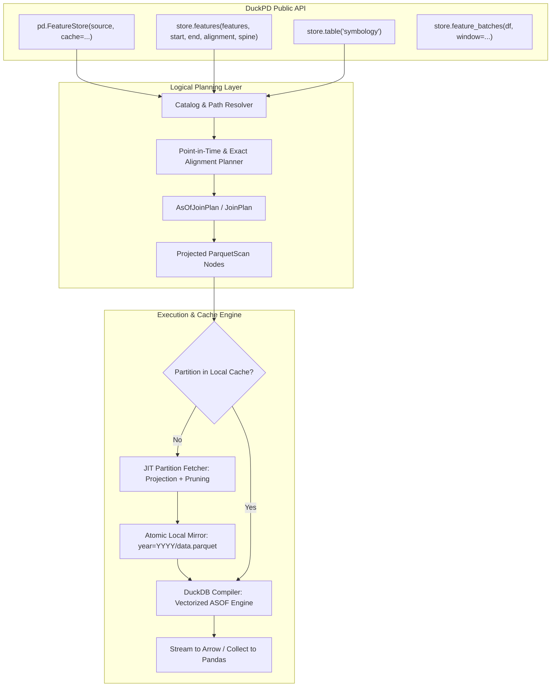

# Feature Store Implementation Roadmap: Native DuckPD Feature Stores

**Status: proposed design & architecture blueprint.**
Reviewed against the local `pymfs` 0.1.5 prototype and DuckPD 0.1.3 sources on 2026-09-05.
All APIs, classes, and workflows documented herein represent implementation targets in the true DuckPD spirit.

---

## 1. Vision & Core Philosophy: The DuckPD Spirit

A feature store in DuckPD is not an orchestrator, an ingestion service, or a micro-daemon.
It is a **high-performance, point-in-time analytical retrieval engine** built for data scientists
and quantitative researchers working with massive, structured Parquet datasets.

### 1.1 The Problem with the Original `pymfs` Prototype
The experimental `pymfs` prototype tried to solve two distinct problems at once:
1. **Analytical Value (The 90%):** Semantic cataloging, multi-frequency time-series synchronization, and leakage-free point-in-time (`ASOF`) alignment with `availability_delay`.
2. **Operational Complexity (The 10%):** Slicing remote datasets by arbitrary microsecond time intervals, storing ad-hoc fragments (`part-20240101T080000-....parquet`), calculating complex interval subtractions, and reconciling overlapping files with unsafe SQL hacks (`MAX(feature)`).

This fragmentation created severe concurrency hazards (multi-worker training jobs corrupting cache manifests), degraded query performance, and led to an unnatural two-phase developer ceremony (`prepare()` + separate offline store).

### 1.2 The First-Principles DuckPD Solution
DuckPD unifies feature stores into its native relational plan architecture using three simple ideas:

1. **Partition-Mirrored Cache Layout (Zero Fragments, Zero Overlaps):**
   Instead of inventing arbitrary date-sliced files, the local cache **mirrors the native partition layout of the source dataset** (e.g., `ohlcv/year=2024/data.parquet`).
   - **Partition Pruning:** If a user requests 2024 data, 2018–2023 partitions are never fetched.
   - **Column Projection:** Only the specific requested columns (e.g., `close`) are extracted from the multi-gigabyte remote partition. A 20 GB partition downloads as a clean ~300 MB partition file locally.
   - **Standard Parquet:** The resulting cache is simply a valid, standard Parquet dataset that any tool (DuckDB CLI, Polars, pandas) can query directly. No custom manifests or fragment reconciliation needed.
2. **Pure, Instantaneous Constructors (Zero I/O at Setup):**
   Creating a `FeatureStore` or building a feature selection never downloads data, blocks on network calls, or writes files. It only validates schemas and builds an immutable logical plan.
3. **Transparent JIT Execution at Bounded Operations:**
   Data scientists do not need to call a separate preparation script. When they call `.collect()`, `.to_arrow()`, or stream training batches with `.to_arrow_batches()`, DuckPD ensures the required partition files are cached, compiles the native `ASOF` join, and streams rows directly at local NVMe speed.
4. **First-Class Lazy `duckpd.DataFrame` Output:**
   `store.features(...)` and `store.table(...)` return ordinary lazy `duckpd.DataFrame` objects. Researchers can immediately use `.assign()`, filtering, `.groupby()`, and window operations.

The accepted [core contract](../decisions/0001-core-contract.md),
[order/index/session contract](../decisions/0002-order-index-session-contract.md),
and [architecture directives](../decisions/0003-directives-and-architecture.md)
remain authoritative:
- Preserve existing public signatures, behavior, ordering/index rules, execution
  boundaries, remote safeguards, and error behavior outside the new feature.
- Keep immutable logical plans as semantic state. DuckDB relations and generated
  SQL belong in the compiler; do not wrap an eager upstream store in a DataFrame.
- No automatic pandas fallback or Python row-by-row alignment. Do not promise
  zero copies or bounded memory for every join merely because output is streamed.
- Keep Python >=3.11, DuckDB >=1.5,<1.6, pandas >=3.0,<3.1, and PyArrow >=18.
  Do not inherit upstream's higher minimums or its unrelated dependencies.
- Upstream source directories are research inputs only: no runtime dependency on
  `.temp/`, vendored monolith, or new dependency on `pymfs` itself.

**Non-goals:** online serving, feature computation/DAG execution, ingestion,
upload/catalog-authoring services, scheduling, distributed execution, an ML
framework API, or a new general-purpose storage format.

---

## 2. The Core Problem: Why Existing Approaches Fail at Scale

Large quantitative and event-driven feature datasets often span multiple terabytes across dozens of years and hundreds of indicator columns.

### 2.1 The Two Extremes That Do Not Work
1. **Downloading the Whole Dataset Upfront:**
   `aws s3 sync` or `hf_hub_download` for the entire dataset fails immediately: researcher laptops and training VMs do not have 10 TB of local SSD capacity.
2. **Arbitrary Date Slicing (`pymfs` Fragment Approach):**
   Downloading arbitrary microsecond date windows (`part-20240101-20240201-<uuid>.parquet`) requires complex interval subtraction, a stateful `manifest.json`, and broken `MAX(feature)` SQL reconciliation across overlapping files. It fails in multi-process PyTorch training when parallel workers fight over the manifest.

### 2.2 The Partition-Mirrored Solution
Structured feature datasets already adhere to a clean, canonical directory partitioning (e.g., yearly partitions):

```text
Remote Source (Hugging Face / S3):
store/
├── catalog.json
├── ohlcv/
│   ├── year=2020/data.parquet   (100 columns, 15 GB)
│   ├── year=2021/data.parquet   (100 columns, 18 GB)
│   ├── ...
│   └── year=2024/data.parquet   (100 columns, 22 GB)
└── signals/
    └── year=2024/data.parquet   (500 indicators, 45 GB)
```

When a researcher asks for:
```python
features = store.features(
    features={"price": "ohlcv:close", "rsi": "signals:rsi14"},
    start="2024-01-01T00:00:00Z",
    end="2025-01-01T00:00:00Z",
    alignment="point_in_time",
    spine="ohlcv",
)
```

DuckPD executes **Partition Pruning + Column Projection**:
1. **Partition Pruning:** Years 2020–2023 are never touched. Terabytes of history are excluded immediately.
2. **Column Projection:** For partition `year=2024`, DuckPD requests **only** `[datetime, ticker, close]` from `ohlcv` and `[datetime, ticker, rsi14]` from `signals`.
3. **Mirrored Storage:** The local cache writes:
   ```text
   ~/.cache/fdb/
   ├── catalog.json
   ├── ohlcv/
   │   └── year=2024/data.parquet   (~350 MB instead of 22 GB!)
   └── signals/
       └── year=2024/data.parquet   (~280 MB instead of 45 GB!)
   ```

### 2.3 Operational Advantages
- **1:1 File Mapping:** There are no fragments or UUID files. Partition `ohlcv/year=2024/data.parquet` either exists locally or it does not.
- **Zero File Overlaps:** Queries covering Jan–Feb and Mar–Apr simply read the same clean 2024 partition file. No interval subtraction math, and no duplicate-hiding `MAX()` SQL hacks.
- **Multi-Worker Safety:** Per-partition file locks serialize cache expansion, while unique temporary files and atomic replacement ensure multi-process training workers always observe a complete immutable Parquet file. Existing cached columns are retained when a later request expands the projection.
- **Zero Magic:** The local cache directory is just a standard Parquet dataset.

---

## 3. Developer Ergonomics & Target User Scenarios

To ensure great developer ergonomics, the API follows the **"Order what you need, let DuckPD manage the rest"** paradigm.

### Scenario 1: Training a Deep Learning Model (Streaming Arrow Batches)
A researcher training a neural network needs to stream feature batches over a multi-month period without ever loading the entire dataset into memory:

```python
from datetime import timedelta
import duckpd as pd

# 1. Connect to the feature store (zero network downloads happen here!)
store = pd.FeatureStore(
    source="hf://datasets/hifinab/fdb",
    cache="~/.cache/fdb",  # Local partition mirror directory
)

# 2. Declare feature requirements and point-in-time alignment
training_data = store.features(
    features={
        "close": "ohlcv:close",
        "volume": "ohlcv:volume",
        "sma200": "signals:sma200",
    },
    start="2024-01-01T00:00:00Z",
    end="2024-06-01T00:00:00Z",
    filters={"ticker": ["AAPL", "MSFT", "NVDA"]},
    alignment="point_in_time",
    spine="ohlcv",
)

# 3. Apply standard DuckPD / pandas transformations lazily
features_df = training_data.assign(
    normalized_vol=lambda df: df["volume"] / df["volume"].rolling(30).mean()
)

# 4. Stream 30-day training batches directly as PyArrow tables
# Transparent JIT execution: DuckPD fetches missing partition columns on-the-fly,
# compiles the ASOF join, and streams rows directly to your model.
for batch_df in store.feature_batches(features_df, window=timedelta(days=30)):
    with batch_df.to_arrow_batches(batch_size=65_536) as reader:
        for arrow_batch in reader:
            torch_tensor = torch.from_arrow(arrow_batch)
            train_step(torch_tensor)
```

### Scenario 2: High-Speed Offline Research (Local-First Operation)
A quantitative researcher working offline on a train or in an air-gapped compute cluster points DuckPD directly at a local dataset directory.

```python
import duckpd as pd

# Point directly to any local directory matching the catalog structure
store = pd.FeatureStore(source="/mnt/nvme/market_data")

# Exact alignment: synchronous equi-join across datasets sharing the same clock
daily_features = store.features(
    features=["prices:open", "prices:high", "prices:low", "prices:close"],
    start="2023-01-01T00:00:00Z",
    end="2024-01-01T00:00:00Z",
    alignment="exact",
)

# Preview the first 10 rows instantly without scanning the whole dataset
preview = daily_features.sort_values(["datetime", "ticker"]).head(10)
print(preview)
```

### Scenario 3: Joining Categorical Reference Tables (Symbology / Metadata)
Feature stores frequently contain auxiliary reference tables (e.g., industry sectors, listing status, market hours) alongside time-series:

```python
import duckpd as pd

store = pd.FeatureStore(source="hf://datasets/hifinab/fdb", cache="~/.cache/fdb")

# 1. Get time-series features
features = store.features(
    features={"price": "ohlcv:close"},
    start="2024-01-01T00:00:00Z",
    end="2024-02-01T00:00:00Z",
    alignment="point_in_time",
    spine="ohlcv",
)

# 2. Get static reference table as a lazy DataFrame
symbology = store.table("symbology")  # columns: [ticker, sector, market_cap]

# 3. Join them seamlessly using standard DuckPD APIs
enriched = features.merge(symbology, on="ticker", how="left")
tech_stocks = enriched[enriched["sector"] == "Technology"]

# 4. Export directly to Parquet without ever converting to pandas
tech_stocks.write_parquet("tech_features.parquet")
```

### Scenario 4: Headless Cluster Batch Sync (Optional Explicit Preparation)
In production CI/CD or distributed compute clusters, an orchestrator (e.g., Airflow or Kubernetes Job) might want to pre-sync the exact cache partitions before training workers spawn:

```python
import duckpd as pd

store = pd.FeatureStore(source="hf://datasets/hifinab/fdb", cache="/shared/cache")

# Explicit preparation hook: downloads and projects partitions without executing queries
report = store.sync(
    features=["ohlcv:close", "signals:sma*"],
    start="2024-01-01T00:00:00Z",
    end="2025-01-01T00:00:00Z",
)
print(f"Synced {report.partitions_synced} partitions ({report.bytes_written / 1e6:.1f} MB)")
```

---

## 4. Architectural Design & Integration Points



### 4.1 Integration Components

1. **`duckpd.featurestore.FeatureStore`:**
   The public entry point. Holds the connection `Session`, resolved `catalog.json`, and cache configuration.
2. **Catalog v1 Specification:**
   Validates `catalog.json` at store initialization. Reads `timeseries` and `table` specifications, time columns, series keys, and feature definitions.
3. **Partition-Mirrored Cache Manager:**
   Determines the set of yearly/monthly partition paths required by `[start, end)`. Checks if local files exist and contain the required column subset. If missing or incomplete, streams the partition from the remote provider, projects only requested columns, and writes atomically to `cache_dir/<dataset>/<partition_path>`.
4. **Typed `AsOfJoinPlan` in DuckPD Core:**
   Adds native relational ASOF join representation to DuckPD's logical plan IR.
   - Equi-join keys: `series_keys` (e.g., `ticker`).
   - As-of inequality: `spine.datetime >= target.datetime + INTERVAL <delay> MICROSECOND`.
   - Direction: `backward` (latest available observation).
5. **DuckDB Compiler Integration:**
   Translates `AsOfJoinPlan` into DuckDB's native vectorized `ASOF JOIN` execution path.

---

## 5. Temporal Alignment & Point-in-Time Correctness

### 5.1 The Explicit Spine Contract
In `pymfs`, the first selected dataset implicitly determined the time spine. This caused surprising behavior: swapping feature order changed the output row count.

In DuckPD:
- **Point-in-time alignment requires an explicit `spine` parameter** (e.g., `spine="ohlcv"`).
- The spine dataset provides the definitive clock and entity universe for `[start, end)`.
- Every spine row is preserved (`ASOF LEFT JOIN`).

### 5.2 Availability Delay & Lookahead Protection
To prevent data leakage during backtesting and training:
- Each feature in `catalog.json` specifies an ISO 8601 `availability_delay` (e.g., `PT1M` for 1-minute close prices, `PT0S` for open prices, `PT2H` for fundamental updates).
- In point-in-time mode, DuckPD guarantees that an observation is only visible to the model after `observation_time + delay`.
- Features missing `availability_delay` or marked `lookahead_safe: false` fail fast during planning.

### 5.3 Sparse History & Predecessors
If a technical indicator or economic signal updates infrequently (e.g., once a day or once a week), a model running at 10:00 on Monday must see Friday's signal.
- Slicing queries strictly to `start - max_delay` is incorrect for sparse series.
- DuckPD's partition resolver ensures that the partition containing the **latest eligible predecessor before `start`** is accessible, preventing artificial null gaps at the start of backtests.

---

## 6. Implementation Phases & Milestones

### Phase 1: Local Catalog & Exact Alignment (The Local Foundation)
- **Milestone:** Support cataloged local Parquet directories (`source="/data/features"`).
- **Deliverables:**
  - `src/duckpd/featurestore.py` module and `pd.FeatureStore` facade.
  - Catalog v1 parser & validator (`catalog.json`, `metadata.json`).
  - Canonical feature reference resolution (`dataset:feature`, aliases, `dataset:*` wildcards).
  - Exact alignment planner using existing DuckPD `merge()` / `JoinPlan`.
  - Reference table access (`store.table(...)`).
- **Exit Gate:** 100% offline unit tests on synthetic multi-family datasets. Exact alignment matches expected pandas DataFrames.

### Phase 2: Native Point-in-Time Alignment (`AsOfJoinPlan`)
- **Milestone:** True leakage-free temporal joins inside DuckPD.
- **Deliverables:**
  - Add typed `AsOfJoinPlan` to `duckpd._logical`.
  - Implement DuckDB compiler support for `ASOF LEFT JOIN` with `availability_delay` interval predicates.
  - Update optimizer traversals (`_rewrite_tree`, column liveness) and executor validation.
  - Implement `store.feature_batches(df, window=...)` yielding lazy time-windowed frames.
- **Exit Gate:** Verification that zero-delay and positive-delay features match theoretical event times. Independent validation of irregular/sparse series predecessor matching.

### Phase 3: Partition-Mirrored Remote Caching (Hugging Face / HTTP)
- **Milestone:** Seamless, transparent JIT partition fetching.
- **Deliverables:**
  - Partition resolver for standard path templates (`year={year}/data.parquet`).
  - JIT partition fetcher with cumulative column projection, per-partition coordination, unique temporary files, and atomic replacement.
  - Optional `duckpd[featurestore]` dependency extra (`huggingface-hub`).
  - Optional `store.sync(...)` headless pre-fetch helper.
- **Exit Gate:** Multi-process test verifying that parallel workers expanding the same cached partition retain every requested column without file corruption.

### Phase 4: Ergonomics, Benchmarks & Documentation
- **Milestone:** Production readiness and documentation.
- **Deliverables:**
  - End-to-end interactive demo walkthrough (`demo/DuckPD_FeatureStore_Walkthrough.ipynb`).
  - Performance benchmarks comparing remote streaming vs. local NVMe cached execution.
  - Update `docs/COMPATIBILITY.md` and `docs/CHANGELOG.md`.

---

## 7. Comparison: `pymfs` vs. Native DuckPD FeatureStore

| Capability | Prototype (`pymfs`) | Native DuckPD FeatureStore |
| :--- | :--- | :--- |
| **Data Representation** | Raw `duckdb.DuckDBPyRelation` | Native lazy `duckpd.DataFrame` |
| **Cache Architecture** | Microsecond date fragments (`part-...<uuid>.parquet`) | Partition-mirrored (`year=YYYY/data.parquet`) |
| **Overlapping Queries** | Broken `MAX(feature)` SQL reconciliation | Zero overlap; 1:1 partition mapping |
| **Cache Execution** | Eager download in constructor | Transparent JIT at execution boundaries |
| **Multi-Process Training** | High risk of manifest race conditions | Coordinated expansion with unique staging files and atomic replacement |
| **Time Spine** | Implicit (first selected feature) | Explicit parameter (`spine="ohlcv"`) |
| **Downstream Queries** | Hardcoded SQL strings | Idiomatic pandas syntax (`df.assign()`, `.rolling()`) |
| **Dependency Footprint** | Heavy mandatory dependencies | Core DuckPD (zero new deps); optional HF extra |
