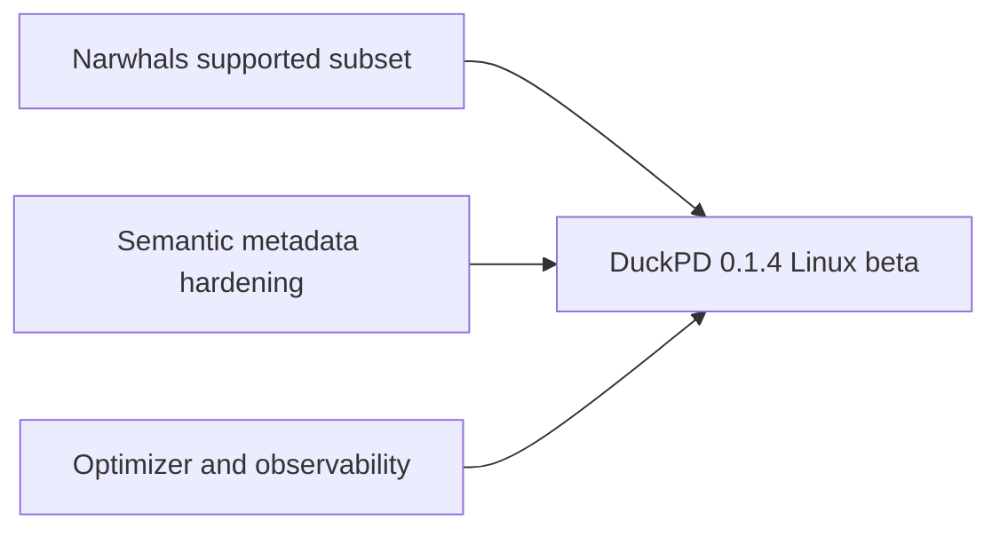

# DuckPD implementation roadmap

DuckPD should be built as a **lazy relational DataFrame with a deliberately
bounded pandas-compatible API**, backed by DuckDB. It should not claim that
arbitrary pandas programs can run unchanged.

This plan favors a standalone implementation over a Modin backend. Modin's
API/compiler/executor layering is useful precedent, but its partition and
distributed-execution machinery is not needed for one DuckDB query plan.

Competitive research, implementation references, and the measurable definition
of "beat FireDucks" live in
[`docs/references/competitive-landscape.md`](references/competitive-landscape.md).

## Product contract

### Promises

- Pandas-shaped `DataFrame`, `Series`, `GroupBy`, indexing, and expression APIs.
- Lazy transformations: public transformation methods build immutable plans.
- Explicit execution through `collect()`, bounded previews, streaming readers,
  direct file/table sinks, or persistence.
- No silent full-frame fallback to pandas.
- Index, row identity, and ordering are explicit metadata, not assumptions.
- Unsupported operations and unsupported argument combinations fail before a
  query starts.
- Direct writes never pass through a pandas DataFrame.
- Larger-than-memory behavior is tested, while DuckDB's documented spill
  limitations remain visible to users.

### Initial non-goals

- Drop-in compatibility with arbitrary pandas code.
- General MultiIndex construction/manipulation or duplicate displayed column
  labels. Grouped rolling collection may emit pandas' group-key-prefixed
  MultiIndex as a narrowly defined result contract.
- Arbitrary row-wise `apply(axis=1)`.
- Python `object` dtype compatibility beyond a documented safe subset.
- Positional operations when stable ordering is unknown.
- Implicit mutation of source files or remote tables.
- A proprietary delta-log or lakehouse storage format.
- Distributed execution, Ray, or Dask.
- Universal remote SQL pushdown in the first release.

## Version and support baseline

Confirm these in an architecture decision record before publishing the first
package:

- [x] Use Python 3.11+ for the first release.
- [x] Use one pandas minor line as the semantic oracle; start with pandas 3.0.
- [x] Develop against DuckDB 1.5, with upper bounds until compatibility CI
      proves the next minor version.
- [x] Make pandas and DuckDB required dependencies.
- [x] Decide whether PyArrow is required or an `arrow` extra. Requiring it is
      recommended for the first release because streaming is a core promise.
- [x] Confirm that the `duckpd` distribution name is available on PyPI.
- [x] Configure Linux, macOS, and Windows CI on Python 3.11 through 3.14;
      final Windows-specific validation is deferred to the beta exit gate.

## v0.1 acceptance workflow

The alpha is useful when this runs lazily and matches pandas for the supported
arguments:

```python
import duckpd as pd

orders = pd.read_parquet(
    "orders/*.parquet",
    index="order_id",
    order_by=["created_at", "order_id"],
)

monthly = (
    orders[orders["status"] == "paid"]
    .assign(
        month=lambda frame: frame["created_at"].dt.to_period("M"),
        net_amount=lambda frame: frame["amount"] - frame["refund_amount"],
    )
    .groupby(["month", "customer_id"], as_index=False)
    .agg(
        revenue=("net_amount", "sum"),
        order_count=("order_id", "size"),
    )
    .sort_values(["month", "revenue"], ascending=[True, False])
)

monthly.explain()
preview = monthly.head(20)
result = monthly.collect()
monthly.write_parquet("monthly.parquet")
```

Acceptance conditions:

- [x] No source rows are read before `explain()`, `head()`, `collect()`, or
      `write_parquet()`.
- [x] `head(20)` executes a plan containing `LIMIT 20` and returns at most 20
      rows.
- [x] `collect()` returns a real pandas DataFrame with the documented index,
      labels, order, and dtypes.
- [x] `write_parquet()` executes directly in DuckDB and never constructs a
      pandas DataFrame.
- [x] The result matches an equivalent pandas pipeline on differential test
      fixtures containing nulls, empty inputs, and duplicate index values.
- [x] `explain()` shows the DuckPD logical plan, generated DuckDB SQL, physical
      plan, execution boundaries, and ordering/index guarantees.

## Architecture baseline

```text
duckpd public API
DataFrame / Series / GroupBy / indexers / readers
                    |
                    v
pandas-semantic layer
validation + rewrites + metadata transitions
                    |
                    v
typed immutable logical plan and expression IR
                    |
                    v
DuckDB compiler -> DuckDBPyRelation / DuckDB expressions
                    |
                    v
Session and executor
collect | Arrow batches | table | Parquet | commit
```

### Core invariants

- `DataFrame` is a mutable Python handle to an immutable `FrameState`.
- `Series` is a typed expression bound to a frame lineage, not a vector.
- Every physical column has an internal `ColumnId` independent of its displayed
  label.
- Every plan transformation declares how it changes schema, index, ordering,
  row identity, and source provenance.
- Displayed labels are unique in v0.1. Reject duplicates explicitly.
- An absent index may become a pandas `RangeIndex` at collection, but it is not
  a stable alignment key inside a lazy plan.
- Same-lineage Series expressions combine without joins. Cross-frame
  expressions require compatible explicit indexes or fail.
- Positional and window operations require guaranteed ordering.
- The compiler accepts typed nodes, never user values interpolated into SQL.
- The executor is the only layer allowed to trigger DuckDB output methods.
- Public wrappers do not expose mutable `DuckDBPyRelation` objects as state.

### Initial logical plan

- [x] `Scan` for Parquet, DuckDB tables, SQL subqueries, pandas, and Arrow.
- [x] `Project` for selection, assignment, rename, cast, and expression output.
- [x] `Filter`.
- [x] `Aggregate` for global reductions and grouped aggregations (`GroupBy.agg`).
- [x] `Join` for DataFrame merges (`DataFrame.merge`) and index joins (`DataFrame.join`).
- [x] `Sort`.
- [x] `Limit`.
- [x] `Union` for row-wise concatenation.
- [x] `Window`.
- [x] Persisted intermediates represented as `ScanPlan(TableSource)`.

Keep writes as executor sinks rather than relational nodes until a concrete
optimizer need proves otherwise.

### Initial expression IR

- [x] `ColumnRef(ColumnId)` and `Literal`.
- [x] Unary, binary, and boolean expressions.
- [x] `Function`, `Case`, and `Cast`.
- [x] `AggregateExpression` for global reductions.
- [x] `WindowExpression` with partition, order, and frame metadata.
- [x] Typed aliases and nullability.

### Frame metadata

- [x] `Schema`: internal IDs, displayed labels, DuckDB type, pandas dtype,
      nullability, and hidden/visible state.
- [x] `IndexSpec`: absent/deferred range index or explicit index columns,
      uniqueness state, and names.
- [x] `OrderSpec`: unknown or guaranteed ordered keys, directions, null
      placement, and stability.
- [x] `RowIdentity`: stable/unique source ordinals, composite reindex and union
      identities, and explicit clearing across joins and aggregates.
- [x] `SourceProvenance`: sanitized canonical locations, fingerprints, write
      capability, and row-preserving transformation history.
- [x] `FrameState`: plan, schema, index, order, row identity, provenance, and
      owning session.

### Proposed package layout

```text
src/duckpd/
    __init__.py
    frame.py
    series.py
    groupby.py
    indexing.py
    accessors.py
    io.py
    session.py
    options.py
    errors.py
    logical/
        expressions.py
        plans.py
        metadata.py
        types.py
        rewrites.py
    compiler/
        duckdb.py
        quoting.py
    execution/
        executor.py
        results.py
        sinks.py
        commit.py
tests/
    unit/
    differential/
    integration/
    execution/
    property/
```

Do not create every module up front. Add each module with the first behavior it
owns.

## Implementation phases

### Phase 0: repository and decisions

Goal: establish the contract and a repeatable development environment.

- [x] Add `pyproject.toml` using a `src` layout and a small build backend.
- [x] Manage environments and commands with `uv`.
- [x] Add runtime dependencies and a `dev` dependency group.
- [x] Configure Ruff, Pyright, pytest, coverage, and pre-commit.
- [x] Add CI for lint, type checking, unit tests, and package builds.
- [x] Add optional Make targets for setup, focused checks, the complete quality
      gate, demo smoke runs, builds, release validation, and cleanup.
- [x] Enforce Ruff formatting in pre-commit and CI.
- [x] Add package classifiers, project URLs, and the PEP 561 typed-package
      marker.
- [x] Organize project documentation under `docs/`, add a documentation index,
      and retain conventional root-level project files.
- [x] Add `CONTRIBUTING.md`, a changelog, and architecture decision records.
- [x] Record explicit decisions for:
  - eager `head()` versus lazy `limit()`;
  - `collect()` and `to_pandas()` aliases;
  - implicit module-level sessions and their lifetime;
  - `DataFrame` construction from Python data;
  - behavior of `len`, `shape`, `repr`, and scalar reductions;
  - absent index versus explicit index behavior;
  - default unsupported-operation policy;
  - dependency/version support.
- [x] Recommended API decision: make `limit()` lazy, make `head()` a bounded
      eager pandas preview, and make `repr` plan-focused so display does not
      unexpectedly scan remote data.
- [x] Define exception classes such as `UnsupportedOperationError`,
      `UnorderedOperationError`, `AlignmentError`, `MaterializationError`, and
      `ConcurrentModificationError`.

Exit gate:

- [x] `uv sync`, `uv run pytest`, `uv run ruff check .`,
      `uv run ruff format --check .`, `uv run pyright`, and `uv build` pass in
      a clean checkout.

### Phase 1: walking vertical slice

Goal: prove the complete lazy path before broadening the API.

- [x] Implement `Session` as the owner of one DuckDB connection, configuration,
      registered Python/Arrow sources, temporary objects, and cleanup.
- [x] Support `memory_limit`, `temp_directory`, maximum temporary size,
      `threads`, and read-only mode where applicable.
- [x] Implement the initial metadata objects and immutable plan/expression
      dataclasses.
- [x] Implement `DuckDBCompiler.compile_plan()` and `compile_expression()`.
- [x] Prefer DuckDB's relation and expression APIs. Use a contained SQL path
      only for features those APIs cannot express, with centralized identifier
      quoting and literal handling.
- [x] Implement `DataFrame` and `Series` wrappers with lineage validation.
- [x] Implement `read_parquet()`, `from_pandas()`, `from_arrow()`,
      `Session.table()`, and `Session.sql()`.
- [x] Implement column selection, list projection, scalar arithmetic,
      comparisons, boolean expressions, filtering, `assign()`, `sort_values()`,
      and lazy `limit()`.
- [x] Implement `collect()`, bounded `head()`, `to_arrow()`,
      `to_arrow_batches()`, `write_parquet()`, and `explain()`.
- [x] Add an executor event hook or counter so tests can prove transformations
      do not execute.
- [x] Retain references to registered pandas/Arrow sources for the complete
      lifetime of any dependent plan.
- [x] Ensure closed sessions produce a clear error instead of a dangling
      DuckDB failure.

Exit gate:

- [x] A Parquet scan can be filtered, projected, sorted, previewed, collected,
      streamed, explained, and written through one lazy plan.
- [x] Unit tests prove all non-sink calls leave the execution counter at zero.
- [x] Inputs containing quoted identifiers and hostile string values compile
      safely and return correct results.

### Phase 2: schema, dtype, null, index, and order semantics

Goal: make metadata trustworthy before implementing many methods.

- [x] Define the supported DuckDB-to-pandas collection matrix for boolean,
      signed/unsigned integer, floating, string, binary, decimal, date,
      timestamp, timezone-aware timestamp, and interval values.
- [x] Preserve supported pandas nullable-extension and temporal source dtypes
      through identity-preserving plans.
- [x] Define and test separate collection policies for `pd.NA`, `NaN`, `NaT`,
      and SQL `NULL`, including nulls introduced by outer joins.
- [x] Reject nested DuckDB list, array, struct, map, union, and enum types at
      source inspection until their pandas representation is stable.
- [x] Implement displayed-label lookup through internal column IDs.
- [x] Keep hidden index and ordering columns available through projections.
- [x] Implement metadata transition functions for every existing plan node.
- [x] Add DuckPD-owned expression metadata inspired by Narwhals:
      elementwise, preserves-length, scalar-like, literal, windowed,
      order-dependent, and static/multi-output expansion state.
- [x] Use expression metadata to validate broadcasting, window rewrites,
      assignment length, and operations that require an explicit order.
- [x] Implement explicit `set_index()` and `reset_index()` without assuming
      uniqueness.
- [x] Add `order_by=` declarations to establish or override ordering at
      data-source boundaries.
- [x] Reject order-dependent methods when `OrderSpec` is unknown.
- [x] Define collection behavior for absent, explicit, duplicate, named, and
      null-containing indexes.
- [x] Define Series behavior after the parent DataFrame handle is reassigned:
      the Series remains bound to the immutable state from which it was created.
- [x] Ensure metadata inspection does not accidentally execute row-producing
      queries.

Exit gate:

- [x] Metadata unit tests cover every plan node and cannot leave dangling
      index/order column IDs.
- [x] Differential tests match pandas for supported dtype/null/index cases.

### Phase 3: core single-frame pandas API

Goal: cover common analytical transformations that do not require alignment.

- [x] `rename`, `drop`, `astype`, `fillna`, `dropna`, `isna`, `notna`, `where`,
      and `mask`.
- [x] `rename` and `drop` for column labels with `errors`, `axis`, and `columns`
      keyword support; index renaming and row dropping remain unsupported.
- [x] `astype` for Series and DataFrame supporting string/pandas/DuckDB dtype mappings.
- [x] `fillna` for Series and DataFrame supporting scalar and column-mapping dicts.
- [x] `dropna` for Series (axis=0) and DataFrame with `how='any'/'all'`, `subset`, and `thresh`.
- [x] `where` and `mask` for Series and DataFrame with `cond` and `other` expressions.
- [x] Scalar and Series arithmetic, comparisons, boolean operations, and casts.
- [x] Reductions: `count`, `size`, `sum`, `mean`, `min`, `max`, `std`, `var`,
      `median`, `quantile`, `any`, and `all`.
- [x] Implement eager `count`, `size`, `sum`, `mean`, `min`, `max`, `std`, `var`,
      `median`, `quantile`, `any`, and `all` reductions for Series and
      column-wise DataFrame over numeric and boolean data.
- [x] Match pandas 3.0 for `skipna`, `min_count`, `ddof`, `bool_only`, empty,
      all-null, boolean, numeric, and hidden-index cases.
- [x] Propagate basic numeric expression types through `assign()` so assigned
      arithmetic columns can be reduced without collecting.
- [x] Implement pandas-specific reduction semantics, including `skipna`,
      `min_count`, `ddof`, empty inputs, and all-null inputs.
- [x] `drop_duplicates` with `keep="first"`, `keep="last"`, and `keep=False`
      using explicit ordering and window rewrites.
- [x] `value_counts`, `nunique`, `unique`, `nlargest`, and `nsmallest`.
- [x] `clip(lower, upper)` for Series and DataFrame via bounded `CASE WHEN` compilation.
- [x] `replace(to_replace, value)` for Series and DataFrame scalar, list, and dictionary value replacements.
- [x] Implement `sample(n=..., frac=..., random_state=...)` with deterministic
      seed behavior and explicit ordering metadata transitions.
- [x] Reject unsupported axes, argument combinations, and reduction dtypes
      before execution for the implemented reduction subset.
Exit gate:

- [x] Every method has differential tests for ordinary, null, empty, and
      duplicate-value cases.
- [x] Plan tests verify that streaming operations remain a single DuckDB query.

### Phase 4: GroupBy and aggregation

Goal: support the most valuable analytical workflow with pandas semantics.

- [x] Implement `DataFrame.groupby()` and `DataFrameGroupBy` wrapper with
      named aggregation (`agg(new_name=("col", "func"))`).
- [x] Support `as_index=True/False`, `sort=True/False`, and `dropna=True/False`
      in `GroupBy.agg`.
- [x] Support core aggregate functions: `sum`, `mean`, `min`, `max`, `count`, `size`.
- [x] Support dict and function-name string aggregation forms in `GroupBy.agg`.
- [x] Support `DataFrameGroupBy` convenience methods (`sum`, `mean`, `min`, `max`, `count`, `size`) and column selection `g['col']` / `g[['col1', 'col2']]`.
- [x] Implement `Series.groupby()` returning `SeriesGroupBy` with `agg`, `sum`, `mean`, `min`, `max`, `count`, `size`, `std`, `var`, `median`.
- [x] Support categorical grouping with tested `observed=True/False` behavior;
      unused-category expansion currently covers one key with `sort=True` and
      `dropna=True`.
- [x] Run the bounded Ibis substrate spike defined in the competitive landscape
      guide and record the decision to retain the native DuckDB compiler in ADR
      0004, including SQL, semantic gaps, compile cost, and dependency tradeoffs.
- [ ] Defer arbitrary `GroupBy.apply`.

Exit gate:

- [x] GroupBy differential tests cover null keys, multiple keys, named
      aggregations, ordering, and dtype output.

### Phase 5: merge, join, concat, and alignment

Goal: implement cross-frame behavior without pretending SQL joins equal pandas
alignment.

- [x] Implement `merge()` for inner, left, right, outer, and cross joins.
- [x] Support `on`, `left_on`, `right_on`, `left_index`, `right_index`,
      `suffixes`, and `sort` parameters in `merge()`.
- [x] Match pandas null-key behavior explicitly (`IS NOT DISTINCT FROM` in SQL
      joins so null matches null as in pandas).
- [x] Implement `join()` on top of the same semantic merge operation.
- [x] Implement `validate=` cardinality checks as explicit validation queries.
- [x] Implement `concat(axis=0)` with schema reconciliation and stable source
      order.
- [x] Implement `concat(axis=1)` as index-aligned full outer join with column collision suffix management.
- [x] Implement arithmetic between frames as index alignment joins only when
      both sides have compatible explicit indexes.
- [x] Reject ambiguous alignment rather than falling back to position.
Exit gate:

- [x] Differential tests cover duplicate keys, null keys, unmatched rows,
      suffix collisions, index names, and output order.

### Phase 6: ordering, indexing, and windows

Goal: add positional and order-sensitive behavior only on sound foundations.

- [x] Implement label-based `.loc` reads for explicit indexes.
- [x] Implement a documented subset of `.iloc` reads when stable order exists.
- [x] Implement positional slicing through row-number windows.
- [x] Implement `shift`, `diff`, `pct_change`, `cumsum`, `cummin`, `cummax`, and
      `cumprod`.
- [x] Implement `rank` methods with pandas tie, null, percentage, and ascending
      behavior.
- [x] Extend `drop_duplicates` to support `keep='last'` and `keep=False` via
      window row numbers and counts.
- [x] Implement expanding and rolling `count`, `sum`, `mean`, `min`, `max`,
      `std`, and `var` for row-based windows first.
- [x] Implement pandas-compatible `DataFrameGroupBy.rolling()` and
      `SeriesGroupBy.rolling()` for row-based windows, compiling group keys to
      window partitions while preserving explicit ordering within each group.
- [x] Support alignment-safe assignment of grouped rolling results back to the
      originating frame without materialization; arbitrary Python
      `GroupBy.transform` callbacks remain out of scope.
- [x] Add fixed-duration time-based rolling windows with explicit ascending
      timestamp ordering, timezone-aware instants, all four `closed` boundary
      modes, grouped partitions, and explicit rejection of null or duplicate
      timestamp peers.
- [x] Track when joins, aggregates, unions, and materialization destroy or
      establish order guarantees.

Exit gate:

- [x] Positional/window tests use automatic CSV/Parquet and snapshot order;
      equivalent SQL/table inputs fail with `UnorderedOperationError` until an
      explicit order is established.
- [x] Ordered cases match pandas with duplicate sort keys and nulls.

### Phase 7: string, datetime, and categorical accessors

Goal: cover high-use vectorized accessors without opening arbitrary Python
execution.

- [x] Add `Series.str` methods backed by DuckDB string functions:
      `upper()`, `lower()`, `strip()`, `len()`, `startswith()`, `endswith()`,
      `contains()`, `replace()`.
- [x] Add `Series.dt` fields (`year`, `month`, `day`, `hour`, `minute`, `second`, `date`),
      `strftime()`, and `to_period()` representation.
- [x] Add fixed-duration timestamp/timedelta arithmetic, exact
      `floor`/`ceil`/half-even `round`, IANA timezone conversion, UTC
      localization, and timezone removal. Non-UTC localization and
      local-wall-time rounding remain explicit exclusions.
- [x] Add a limited categorical representation and `.cat`, preserving category
      order, unused categories, and ordered state through supported
      transformations and pandas collection.
- [x] Add differential tests for Unicode, empty strings, nulls, and format patterns.

Exit gate:

- [x] The v0.1 acceptance workflow's monthly period expression matches pandas.
- [x] Temporal and categorical differential tests cover negative/tied
      timestamps, DST-boundary instants, invalid planning combinations,
      categorical accessors, ordered comparisons, metadata propagation, and
      observed/unobserved grouping.

### Phase 8: execution, persistence, and observability hardening

Goal: make execution boundaries safe and explainable.

- [x] Implement `to_pandas()`, `to_arrow()`, `to_arrow_batches()`, and optional
      pandas-batch iteration with explicit memory behavior.
- [x] Implement `persist()` to temporary and named DuckDB tables.
- [x] Implement `save_as_table()` and append behavior with schema validation.
- [x] Implement direct CSV and Parquet sinks using relation writers or
      `COPY (query) TO`; request `RETURN_STATS` where a report is needed.
- [x] Keep sink paths and options parameterized or safely escaped.
- [x] Add `explain(mode="logical" | "optimized" | "json" | "sql" |
      "physical" | "all")`.
- [x] Add an optimized logical-plan view with named rewrite passes and
      before/after plan snapshots.
- [x] Implement required-column analysis, projection/predicate pushdown,
      limit/top-k pushdown, and redundant project/sort elimination where these
      add pandas-semantic knowledge beyond DuckDB's optimizer.
- [x] Add liveness and common-subplan analysis; recommend explicit `persist()`
      before considering automatic cache insertion.
- [x] Add `profile()` using DuckDB's structured JSON profiling. Report DuckPD
      planning/execution timing plus DuckDB operator, I/O, spill, and total
      metrics.
- [x] Support machine-readable optimized plans and profile output without
      parsing DuckDB's human-readable plan text.
- [x] Add a Linux benchmark context that forces complete execution and
      separately reports optimizer and execution costs.
- [x] Add `explain_write()` with strategy, estimated scan, blocking operators,
      ordering guarantees, spill configuration, and expected extra disk use.
- [x] Mark estimates as estimates and avoid executing full counts merely to
      populate an explanation.
- [x] Detect known non-spillable operations such as large `list` or
      `string_agg` states and reject them under the strict resource policy.
- [ ] Consider persisted stages when a plan contains several large blocking
      operators; require benchmark evidence before adding automatic staging.
- [ ] Ensure errors include the DuckPD operation and plan context without
      leaking credentials.

Exit gate:

- [x] A generated data test larger than the configured memory budget completes
      with a configured spill directory and measured bounded process memory.
- [x] Augment benchmark reporting and `test_execution_limits.py` to capture true
      process peak RSS (`getrusage`/`/proc/self/status`) and verify DuckDB temporary
      spill file generation during constrained-memory sorts and joins.
- [x] A test forbids pandas conversion methods during every direct sink.

### Phase 9: lazy mutation and safe local commit

Goal: make pandas-shaped assignment mutate only the Python plan until an
explicit sink is called.

- [x] Implement `DataFrame.__setitem__` by replacing the handle's `FrameState`
      with a new `Project` plan.
- [x] Implement a narrow `.loc[mask, column] = value` as a `Case` expression.
- [x] Initially require assignments to be row-preserving and reject schema or
      index ambiguities.
- [x] Define copy and alias behavior for two DataFrame handles sharing one
      immutable state.
- [x] Implement `commit()` only for a single writable local Parquet source in
      the first iteration.
- [x] Capture source path, size, modification time, and optional content hash.
- [x] Write to a unique staging file in the destination directory.
- [ ] Collect DuckDB `COPY` row/file/column statistics without collecting rows.
- [x] Validate schema, expected row-preservation, output readability, and
      source fingerprint.
- [x] Atomically replace the source with `os.replace()` only after validation.
- [x] Support retaining the previous version and return a structured report.
- [x] Inject failures before staging, during/after writes, during validation,
      around backup creation, before replacement, and in replacement; tests prove
      the original remains byte-identical/readable and temporary files are removed.
- [x] Add a process-level lock or explicitly document single-writer behavior
      before claiming concurrency safety. The initial implementation documents
      single-writer operation and does not claim locking against unrelated writers.
- [ ] Add partition-aware rewrites only after full-file commit is reliable.

Exit gate:

- [x] Assignment performs zero I/O until a sink; tests forbid compilation while
      building `__setitem__`, masked `.loc`, `assign`, and chained plans.
- [ ] A 100 GB-equivalent generated workload can be rewritten with memory tied
      to active batches/operator state rather than result size.
- [x] Concurrent source modification raises `ConcurrentModificationError` and
      does not replace the source.

### Phase 10: controlled Python functions and fallback policy

Goal: offer explicit escape hatches without violating the product's memory
promise.

- [x] Default unsupported behavior to `fallback="error"`.
- [x] Add an explicit Arrow UDF registration API with declared input/output
      types, null handling, exception behavior, determinism, and side effects.
- [x] Allow batch fallback only for operations declared independent by batch.
- [x] Provide `collect_small` only for non-expanding local-Parquet plans with
      fixed-width output, a conservative upper bound, a strict limit, and opt-in.
- [x] Include fallback boundaries and estimated transfer/materialization in
      `explain()`.
- [x] Emit structured reason and estimated/actual bytes for explicit Python
      materialization; profiles expose every Arrow UDF fallback boundary.
- [x] Never use DuckDB relation `map()` as an invisible pandas fallback.
- [x] Test that unsupported and expanding operations fail before any source scan.

Exit gate:

- [x] No public operation can materialize an unbounded pandas object without an
      explicit materialization call or opt-in policy.

### Phase 11: object storage and remote databases

Goal: broaden sources after local semantics are stable.

- [x] Make safe, read-only `Session.attach_postgres()` and
      `Session.attach_mysql()` APIs the first Phase 11 priority. Attached tables
      return lazy DuckPD frames that re-read committed source data at each
      execution boundary; `persist()` remains the explicit snapshot operation.
- [x] Keep connection setup outside `Session.sql()`: use DuckDB secrets or
      structured connection parameters, default attachments to `READ_ONLY`, and
      redact credentials from plans, logs, exceptions, and reprs.
- [x] Test extension installation/loading, session ownership and cleanup,
      transaction visibility, schema-cache invalidation, and repeated
      `collect()` behavior against PostgreSQL 17 and MySQL 8.4.
- [x] Expose source identity and known pushdown capabilities in `explain()` and
      warn or fail before unexpectedly large network scans where transfer cannot
      be bounded.
- [x] Support HTTP/S3/GCS Parquet through DuckDB configuration and scoped,
      session-owned temporary secrets.
- [x] Test projection, predicate, and row-group pruning with `EXPLAIN ANALYZE`.
- [x] Add safe, read-only `Session.attach_sqlite()` support with refresh and
      detach lifecycle coverage.
- [x] Introduce `SourceCapabilities` for projection, filter, aggregation, join,
      window, limit, and sort pushdown.
- [x] Add a backend-neutral source planning/observability model and derive
      conservative pushdown candidates and required local work per remote branch.
- [x] Validate PostgreSQL/MySQL physical projection/filter placement assertions
      against PostgreSQL 17 and MySQL 8.4 disposable live test servers.
- [x] Add safety guards against unexpectedly large network scans.
- [ ] Revisit source-specific PostgreSQL/MySQL transfer-cost estimates in 2027,
      or earlier if DuckDB exposes attributable row or byte metrics. Until then,
      preserve them as unavailable rather than deriving them from file I/O,
      result-set size, or row counts. This is an accepted, non-blocking
      observability limitation.
- [ ] Use versioned object paths plus a manifest/catalog for remote replacement;
      do not claim atomic rename semantics on object stores.
- [ ] Delegate recurring row-level updates to DuckDB, Iceberg, or DuckLake
      tables instead of inventing a storage log.

Exit gate:

- [x] HTTP Parquet integration proves projection/filter pruning with
      `EXPLAIN ANALYZE` and measures bytes served by a range-capable endpoint.
- [x] Run the PostgreSQL/MySQL source-extension physical-plan assertions against
      PostgreSQL 17 and MySQL 8.4.
- [x] Preserve attributable PostgreSQL/MySQL network bytes as unavailable
      (`null`) while DuckDB exposes no source-specific transfer metric. Live
      PostgreSQL 17 and MySQL 8.4 probes confirmed that remote scans report zero
      filesystem bytes and no network-byte counter; total source bytes and
      in-engine result-set sizes are not substitutes.
- [x] Cross-source joins have explicit movement plans visible in `explain()`.

### Phase 12: release quality

Goal: publish a narrow, honest, measurable API.

- [x] Maintain a machine-readable Narwhals compatibility matrix by method,
      arguments, dtype coverage, ordering requirement, and release version.
- [x] Generate user-facing Narwhals compatibility documentation from that matrix.
- [x] Add API docs, tutorials, architecture docs, and unsupported-operation
      guidance.
- [x] Add benchmark result fields for compile time, execution time, peak RSS,
      spill bytes, source bytes read, and attributable remote-transfer bytes;
      preserve unavailable transfer measurements as `null`.
- [x] Add validated cold/warm runs to the reproducible db-benchmark
      GroupBy/join, TPC-H, and synthetic OHLC tracks.
- [x] Compare supported workflows against pandas and direct DuckDB SQL; record
      Polars and FireDucks as unavailable or unsupported instead of omitting
      them until validated adapters exist.
- [x] Track a machine-readable competitive evidence scorecard for correctness,
      safety, scale, observability, performance, portability, interoperability,
      and openness without scoring unavailable evidence.
- [x] Add small, medium, and larger-than-memory benchmark datasets generated
      deterministically rather than checked into Git.
- [x] Run package build/install smoke checks on Linux for Python 3.11, 3.12,
      3.13, and 3.14. Cross-platform validation is deferred to the beta exit
      portability gate.
- [x] Add artifact-content checks for wheel/sdist metadata, required package
      files such as `py.typed`, and exclusion of caches, generated data, and
      secrets.
- [x] Install the built wheel in a clean environment and run an import, version,
      and minimal in-memory DuckPD pipeline smoke test.
- [x] Require release tags, package metadata, and changelog versions to match
      before PyPI Trusted Publishing runs.
- [x] After index/order semantics and the public API stabilize, prototype an
      optional Narwhals compliance plugin so `nw.from_native()` can wrap DuckPD
      as a `LazyFrame` without collecting.
- [x] Require Narwhals interoperability tests to prove `to_native()` returns a
      DuckPD frame, supported transformations remain lazy, and execution stays
      in DuckDB.

#### Practical Narwhals lazy-frame compliance path

“Full compliance” here means implementing the required Narwhals lazy-frame
protocol wherever it maps to DuckPD without eager fallback, hidden collection,
or invented ordering. Optional protocol operations that conflict with DuckPD's
product contract must remain explicitly unsupported and fail before execution.

- [x] Implement a compliant expression object and namespace for `col`, `lit`,
      aliases, broadcasting, supported arithmetic, comparisons, boolean logic,
      casts, and null predicates.
- [x] Map the supported string and datetime expression namespaces onto typed
      DuckPD expressions.
- [x] Map supported numeric, aggregate, cumulative, ranking, and rolling
      expression namespaces onto typed DuckPD expressions.
- [x] Implement expression-based `select`, `with_columns`, and `filter`,
      including Narwhals output-name and scalar-broadcast rules.
- [x] Implement expression-based aggregate dispatch.
- [x] Complete lazy-frame relational methods: `drop_nulls`, `unique`, `top_k`,
      and `with_row_index`; reject `unpivot` and `explode` until DuckDB/DuckPD
      type semantics are defined.
- [x] Add compliant lazy group-by objects and aggregation dispatch, preserving
      DuckPD's explicit ordering and `drop_null_keys` behavior.
- [x] Map supported equi-joins, cross joins, and backward as-of joins; reject
      forward/nearest as-of, semi, anti, and ambiguous ordering before execution.
- [x] Return precise Narwhals schemas for decimal, timestamp/time-zone, duration,
      and common scalar DuckDB types; report intentionally unsupported nested
      list, array, struct, map, union, and enum types as `Unknown`.
- [ ] Implement namespace I/O that maps Narwhals `scan_csv` and `scan_parquet`
      to DuckPD lazy scans. Narwhals 2.25.0 still routes a plugin name through
      `Implementation.UNKNOWN.to_native_namespace()` before entry-point
      dispatch, so public plugin scans fail upstream; direct DuckPD readers
      followed by `nw.from_native()` remain lazy. Lazy `sink_parquet` is
      implemented.
- [x] Define collection backends deliberately: Arrow first, pandas only when
      explicitly requested, and Polars rejected without changing `to_native()`.
- [x] Normalize missing-column, duplicate-column, invalid-operation, and
      multi-output-expression errors to Narwhals exception classes for the
      implemented adapter surface.
- [x] Run Narwhals' backend/compliance tests against the lowest and newest
      supported Narwhals 2.x versions, including empty, null, duplicate, nested
      dtype, and ordering-sensitive cases.
- [x] For every supported adapter operation, assert plan construction performs
      zero executions, `to_native()` returns DuckPD, and collection executes
      through DuckDB exactly once.
- [x] Expand the machine-readable matrix with each implemented protocol method
      and keep generated documentation mandatory in CI.
- [x] Document intentional exclusions such as eager-only Series/DataFrame
      protocols, arbitrary Python `map_batches`, and operations whose semantics
      require an unsupported fallback.
- [ ] Publish a pre-release and collect real unsupported-operation traces only
      with explicit user consent and no query data.
- [x] Define the pre-`1.0` versioning, deprecation, and immutable-release policy.
- [x] Add a manual `make publish` workflow that runs the full release gate and
      publishes an already-versioned tree without silently changing its version.

Exit gate:

- [x] The documented Linux-beta matrix is fully tested, examples run in CI,
      package artifacts install cleanly on supported Linux/Python combinations,
      and unsupported behavior is explicit.

### Phase 13: native vector search and analytical retrieval

Goal: make exact nearest-neighbor retrieval a typed, lazy DuckPD operation
using native DuckDB array functions, with no new required dependency.

- [x] Define the supported fixed-size numeric array contract, including element
      types, dimensions, query coercion, null vectors, and non-finite values.
- [x] Add lazy `Series.vector.distance(query, metric=...)` expressions for
      `cosine`, `l2`, and `inner_product`, with one documented DuckDB function
      and result type for each metric.
- [x] Add a typed `VectorSearchPlan` carrying the input plan, vector column,
      query vector, metric, `k`, execution mode, distance label, and optional
      tie-break metadata.
- [x] Add lazy `DataFrame.vector.search(...)` in exact mode, returning an
      ordinary DuckPD DataFrame ordered by distance and the optional tie-break
      key.
- [x] Reject invalid dimensions, unsupported element types and metrics,
      non-positive `k`, output-label collisions, and invalid tie-break columns
      before source execution where metadata permits.
- [x] Preserve the semantic distinction between filtering before search and
      filtering after top-k retrieval; optimizer tests must prove neither plan
      is rewritten into the other.
- [x] Define `OrderSpec`, row-identity, nullability, schema, and provenance
      transitions for distance expressions and vector search results.
- [x] Compile query vectors as typed parameters rather than interpolated SQL
      literals, including hostile identifiers and invalid numeric inputs.
- [x] Extend `explain()` and `profile()` with metric, dimension, `k`, filter
      placement, exact/approximate strategy, tie-break ordering, and physical
      index use when applicable.
- [x] Add differential tests against an independent brute-force reference for
      all supported metrics, ties, filters, empty inputs, invalid vectors, and
      deterministic ordering.
- [x] Prove exact search remains lazy, executes as one DuckDB query, composes
      with joins/grouping/Arrow streaming/direct sinks, and works for Parquet
      scans and DuckDB tables.
- [x] Benchmark exhaustive search across vector dimensions and row counts,
      recording latency, peak RSS, spill behavior, and direct DuckDB parity
      before making larger-than-memory claims.
- [x] Qualify DuckDB's optional `vss` extension separately for supported DuckDB
      versions, HNSW lifecycle, generated-plan eligibility, filtering
      semantics, persistence, recall, reproducibility, and index memory use.
- [x] Add explicit vector-index create/inspect/drop APIs and
      `mode="approximate"` only after DuckPD can verify that a compatible HNSW
      index is used; approximate requests must otherwise fail before retrieval.
- [x] Update the compatibility matrix, API documentation, changelog, and a
      runnable exact-search example without adding a vector database
      dependency.
- [x] Defer `mode="auto"`, full-text and hybrid retrieval, automatic embedding
      generation, and batched per-row point-in-time search until exact and
      approximate vector contracts are stable.

Exit gate:

- [x] Exact search matches the brute-force oracle, remains lazy through normal
      composition, preserves filter-before-top-k semantics, and exposes its
      strategy in plans and profiles without adding a required dependency.
- [x] Approximate search cannot execute unless DuckPD verifies a compatible
      indexed physical plan, and its recall, memory, persistence, and
      reproducibility limits are documented with benchmark evidence.

### Phase 14: text embeddings and semantic search

Goal: make text-to-vector generation a typed DuckPD operation with bounded
Arrow-batch execution, reusable persisted embeddings, and an explicit
transient-search path, while keeping model runtimes optional.

- [x] Define immutable `EmbeddingModelSpec`, `EmbeddedQuery`, prepared-model
      metadata, and `TextEmbeddingProvider` contracts with stable fingerprints.
- [x] Require model revisions or artifact digests, declared dimensions,
      normalization, pooling, and query/document prefixes without planning-time
      model downloads or inference.
- [x] Qualify one pinned local ONNX embedding backend behind an optional
      `duckpd[embeddings]` extra; prove the core installation gains no required
      model-runtime dependency.
- [x] Add explicit eager model preparation with verified artifacts, atomic cache
      promotion, cache inspection, and actionable missing-backend failures
      before source execution.
- [x] Associate embedding specifications with vector `ColumnId` metadata and
      define preservation or invalidation through projection, rename,
      replacement, arithmetic, joins, and concatenation.
- [x] Add a typed, row-preserving `EmbeddingPlan` carrying text columns, output
      column, model fingerprint, batch size, separator, and null policy.
- [x] Add lazy `DataFrame.embed_text(...)` producing a non-nullable
      `FLOAT[dimension]` column without pandas materialization.
- [x] Execute corpus embedding as a bounded Arrow pipeline with backpressure,
      cancellation, final-partial-batch handling, and per-batch validation of
      row count, type, dimension, finiteness, normalization, and cosine norms.
- [x] Preserve input order and row identity across embedding, reject row-dropping
      null policies, and cover empty text, null components, empty inputs, and
      provider failures explicitly.
- [x] Stream embedded output directly to atomic Parquet and DuckDB-table sinks,
      persisting recoverable model metadata for single-file, multi-file, and
      table round trips.
- [x] Add eager single-query embedding and lazy
      `DataFrame.vector.search_text(...)`, rejecting missing or mismatched
      embedding fingerprints before vector retrieval.
- [x] Add a typed `SemanticSearchPlan` and lazy
      `DataFrame.semantic.search(...)` that embeds the query once, streams
      eligible documents, and retains an exact bounded top-k without persisting
      the corpus.
- [x] Make transient semantic search exact-only, preserve filter-before-top-k
      semantics, deterministic tie-breaking, and ordinary downstream DataFrame
      composition.
- [x] Extend `explain()` with the embedding boundary, backend fingerprint,
      dimension, normalization, batch size, null policy, filter placement,
      persistence state, and repeated-inference warning.
- [x] Extend `profile()` with source rows and text bytes, inference batches,
      tokens when cheaply available, preparation and inference time, throughput,
      peak RSS/device memory, sink bytes, and provider retries.
- [x] Redact document text, query text, credentials, hosted endpoints, cache
      secrets, and mutable model locations from plans, profiles, and errors.
- [x] Differential-test transient top-k against persisted embeddings plus exact
      `vector.search()` for supported metrics, filters, ties, empty inputs, and
      deterministic ordering.
- [x] Prove lazy embedding and semantic search compose with projection, joins,
      grouping, Arrow streaming, Parquet scans, DuckDB tables, and direct sinks
      across cancellation and atomic-failure cleanup.
- [x] Benchmark the pinned local backend across text-length distributions,
      batch sizes, and candidate counts, recording rows/tokens per second, wall
      time, peak RSS, output size, direct-provider parity, and repeated-query
      cost before selecting defaults.
- [x] Replace the stock-news demo's hand-built keyword vectors with the public
      embedding API and document the persistent and transient workflows.
- [x] Update API documentation, compatibility data, changelog, and optional
      dependency installation guidance.
- [x] Add explicit PyTorch Transformers inference on CPU, NVIDIA CUDA, and AMD
      ROCm without changing the default FastEmbed CPU path or silently falling
      back when a requested accelerator is unavailable.
- [x] Qualify `BAAI/bge-small-en-v1.5` on AMD `gfx1150` with ROCm 7.2.4,
      normalized `float32[384]` output, CPU/GPU parity, bounded batches, and
      verified immutable model artifacts.
- [x] Generate and validate the complete 388,491,746-row feature-store corpus,
      including 3,951,636 GPU-embedded news rows and schema-bearing empty days
      across 5,475 daily partitions per time-series dataset.
- [x] Publish the validated 16,427-Parquet-file private feature store, verify
      its catalog and dataset card remotely, and exercise daily partition
      pruning, bounded point-in-time history, and streamed batches.
- [x] Update embedding scripts and notebooks for explicit GPU provider
      registration, named ROCm kernels, dependency preflight, and
      backend-specific persisted vector files.
- [x] Defer hosted providers, automatic caches and refresh, hybrid retrieval,
      reranking, quantization, sparse embeddings, and distributed inference.

Exit gate:

- [x] A remote Parquet corpus can be embedded through a bounded, lazy pipeline
      into a reusable `FLOAT[n]` dataset whose model identity survives reload;
      planning performs no download, inference, or source execution.
- [x] Persisted `search_text()` and transient `semantic.search()` match the exact
      vector oracle, preserve prefilter semantics, expose inference cost and
      boundaries, fail safely, and add no required dependency to core DuckPD.

### Phase 15 — Priority 0: feature-store text embedding integration

Goal: make the generated embedding-aware feature-store catalog usable through
the public text-search API without repeating model specifications, while
preserving side-effect-free planning and explicit supply-chain controls.

Complete these milestones in order:

1. **Model identity and preparation hardening**
   - [x] Require each built-in backend to enforce every field included in
         `EmbeddingModelSpec.fingerprint`; remove or reject fields a backend
         cannot honor.
   - [x] Qualify immutable FastEmbed revision resolution and bind the prepared
         artifact manifest to the declared model identity.
   - [x] Add per-fingerprint preparation locking, concurrent-process
         convergence, atomic failure cleanup, and cache-integrity regression
         tests.
2. **Catalog version 1 metadata**
   - [x] Extend the single `catalog_version: 1` schema with strict
         `embedding_models`, feature `embedding_model`, and table-column
         declarations; do not add catalog-version branches.
   - [x] Validate model fields, references, physical fixed-size numeric array
         types, dimensions, unsupported backends, unknown fields, and
         conflicting declarations.
   - [x] Attach `EmbeddingColumnSpec` to timeseries and table scans and preserve
         it through aliases, projections, filters, exact alignment, and
         point-in-time alignment.
   - [x] Add side-effect-free `FeatureStore.embedding_model(name)` inspection.
3. **Inferred persisted search**
   - [x] Make `DataFrame.vector.search_text(..., model=None)` resolve only
         verified column metadata.
   - [x] Treat an explicit model as a fingerprint compatibility assertion, not
         an override; keep raw-vector search independent of model preparation.
   - [x] Report model origin (`catalog`, `sidecar`, or `explicit`) and prepared
         state in non-executing explain output without exposing query text.
4. **Execution-time automatic preparation**
   - [x] Add store-scoped automatic-preparation policy backed by session-owned
         providers; shared-session conflicts use the stricter policy.
   - [x] Resolve timeout and download-size safeguards before enabling automatic
         preparation by default.
   - [x] Prepare a missing approved local model immediately before query
         inference and, where possible, before feature-partition transfer.
   - [x] Separate catalog access, model preparation, cache reuse, partition
         transfer, query inference, and vector search in profile metrics.
5. **Qualification and authoring closure**
   - [x] Centralize catalog serialization of `EmbeddingModelSpec` so generators
         cannot duplicate or drift from runtime identity rules.
   - [x] Qualify local and remote feature stores with cold, warm, explicitly
         pre-warmed, disabled-auto-prepare, and air-gapped model caches.
   - [x] Exercise the published news catalog through model-omitting
         `search_text()` and document local, remote, pre-warmed, and offline
         workflows.

Exit gate:

- [x] Catalog construction, feature selection, and explain perform no model
      preparation or inference.
- [x] First execution prepares at most once, warm execution reuses the verified
      provider, disabled preparation fails before partition transfer, and
      explicit preparation remains supported.
- [x] Catalog-inferred and explicit-model searches return the same exact result;
      missing, conflicting, or dimension-mismatched metadata fails before
      retrieval.

### Phase 16 — Priority 1: native time-series representations

Goal: ship useful, model-free time-series similarity on the existing exact
vector engine before evaluating learned encoders.

- [x] Add immutable series window/representation specifications, canonical
      fingerprints, typed queries, and additive column metadata without
      changing text embedding fingerprints.
- [x] Define propagation and invalidation through projection, rename,
      assignment, joins, ASOF payloads, concatenation, and persistence.
- [x] Add fixed-count `Rolling.to_array()` and `GroupedRolling.to_array()` with
      explicit ordering, complete-window, finite-float32, and group-boundary
      contracts.
- [x] Add native `DataFrame.embed_series()` for declared centering,
      normalization, channel ordering, flattening, and zero-scale policy.
- [x] Add exact `search_series()` and typed-query support in vector distance and
      search, rejecting equal-dimension but incompatible representation spaces.
- [x] Persist and restore series metadata for local Parquet and session-owned
      tables; keep planning free of full-file integrity scans.
- [x] Differential-test ordered windows and exact retrieval against independent
      array and brute-force distance oracles; prove direct sinks avoid pandas
      materialization.

Exit gate:

- [x] Native source and query representations agree within declared float
      tolerances, incompatible spaces fail before retrieval, and filter/history
      semantics are explicit.

### Phase 17 — Priority 2: event windows and exact event similarity

Goal: support news-plus-market-reaction analysis without implying causality or
introducing a joint multimodal model.

- [ ] Add typed fixed-grid `event_windows()` with explicit event/entity keys,
      bar labeling, availability timestamps, missing-bar policy, and duplicate
      handling.
- [ ] Preserve optimizer barriers so filters cannot change contributing window
      rows or move across exact top-k boundaries.
- [ ] Support exact text-first, reaction-first, and full eligible-set
      late-fusion workflows using stable event observation keys.
- [ ] Test grid boundaries, revisions, late bars, overlap exclusions,
      availability cutoffs, and the distinction between exact fusion and
      candidate-limited reranking.

Exit gate:

- [ ] Event windows are complete, ordered, availability-correct, and exact fused
      rankings score the full eligible population.

### Phase 18 — Priority 3: feature-store series declarations

Goal: publish and retrieve deterministic series representations through the
same catalog version 1 metadata path established for text embeddings.

- [ ] Add strict `series_embedding_models`, `series_representations`, and
      `series_representation` declarations to `catalog_version: 1`.
- [ ] Resolve declared `FLOAT[D]` types during planning and validate physical
      types, dimensions, nullability, and representation identity when binding
      partitions.
- [ ] Preserve series metadata through feature aliases, exact alignment, and
      point-in-time ASOF payloads.
- [ ] Support deterministic native representations first; catalog access must
      never generate or refresh corpus representations.
- [ ] Test the complete catalog version 1 schema, registry references, unknown
      fields, offline behavior, and model trust policies.

Exit gate:

- [ ] Catalog-declared native series vectors can be searched without restating
      their representation and without model or network activity during
      planning.

### Phase 19 — Priority 4: optional learned series encoders

Goal: add learned inference only after the native representation and retrieval
contracts are stable and independently useful.

- [ ] Add a session-owned `SeriesEmbeddingProvider` lifecycle with explicit
      preparation, bounded Arrow batches, masks, ordered target/past-only/
      known-future covariate roles, context length, pooling, and output validation.
- [ ] Evaluate immutable Chronos-2 and TimesFM 3 adapters; qualify a built-in
      checkpoint only if its license permits the intended use and a reviewed
      retrieval benchmark demonstrates value over native representations for a
      named task. Do not block native release on this result.
- [ ] Record preparation, inference, memory, and cache metrics without hidden
      normalization, device fallback, or planning-time downloads.
- [ ] Add further adapters without changing the DataFrame, typed-query, or exact
      search contracts.

Exit gate:

- [ ] Corpus and query encoding agree deterministically, provider calls remain
      bounded, failures leave no promoted cache or output, and qualification
      records the exact model artifact and runtime.

### Deferred embedding research

The following have no scheduled implementation priority: hosted embedding
providers, hybrid lexical/vector retrieval, reranking, quantized, sparse, or
multi-vector storage, distributed inference, automatic corpus refresh, vector
`mode="auto"`, batched per-row point-in-time retrieval, and jointly aligned
text/time-series spaces. Promote one only with a separate design, explicit
security and execution semantics, and evidence that the existing exact APIs
cannot express the required workflow.

### Beta exit portability gate

Windows-specific release validation is intentionally deferred until DuckPD is
otherwise ready to leave beta. At that point:

- [ ] Run the full `windows-latest` Python 3.11–3.14 CI matrix.
- [ ] Confirm `GetProcessMemoryInfo` returns non-zero peak RSS and the constrained
      workload remains below its process-memory bound.
- [ ] Exercise Parquet atomic replacement through `ReplaceFileW`, including
      replacement metadata and failure cleanup.
- [ ] Clean-install the built wheel and run the package smoke pipeline on Windows.


## Implementation sequence

Complete numbered increments in order. The active incomplete increments are
decomposed into independently testable milestones below.

1. [x] Project scaffold, `uv`, quality tools, CI, and version policy.
2. [x] Session lifecycle plus Parquet/pandas/Arrow source registration.
3. [x] Typed expressions, minimal plans, metadata, and compiler skeleton.
4. [x] `DataFrame`, `Series`, selection, arithmetic, filtering, and `assign`.
5. [x] `collect`, `head`, Arrow batches, direct Parquet write, and `explain`.
6. [x] Index/order declarations and metadata transition test suite.
7. [x] Initial numeric/boolean null and dtype semantics plus basic `count`,
       `size`, `sum`, `mean`, `min`, and `max` reductions. Broader dtype policy
       and advanced reductions remain in Phases 2 and 3.
   - [x] Add a runnable reduction showcase covering `numeric_only`, `skipna`,
         `min_count`, hidden indexes, assigned expressions, and explicit
         execution counts in `demo/reduction_pipeline.py`.
8. [x] Initial `GroupBy.agg` with pandas semantic rewrites (`as_index`, `sort`,
       `dropna`, named aggregation, and null/dtype handling).
9. [x] Initial `DataFrame.merge` and `DataFrame.join` with pandas null-key
       matching, `suffixes`, `how` modes, and index joins. Concat and frame
       alignment remain in Phase 5.
10. [x] String and datetime accessors (`Series.str` and `Series.dt`) supporting
       the v0.1 acceptance workflow and common analytical transforms.
11. [x] Resource-limit, spill-directory configuration, and larger-than-memory
       integration tests with `explain(mode=...)` and `explain_write()`.
12. [x] Direct-sink zero-materialization verification, streaming Arrow batches,
       and extended relational `.loc` label-list reindexing.
13. [x] Column-wise concatenation (`concat(axis=1)`) via index-aligned full
       outer joins. Cross-frame arithmetic remains in Phase 5.
14. [x] Single-frame analytical cleaning transforms: `clip(lower, upper)` and
       `replace(to_replace, value)` for Series and DataFrame.
15. [x] Structured profiling (`df.profile()`) exposing DuckDB operator and I/O
       timings, plus native process RSS and DuckDB spill byte metrics in
       benchmarks and execution limits.
16. [x] Local Parquet atomic `commit()` workflow (staging file, validation,
       atomic `os.replace`) and persistent DuckDB table sinks (`save_as_table`).
17. [x] Complete the supported Linux-beta Narwhals lazy-frame contract.
    - [x] Prototype wrapping, generated compatibility documentation, expression
          projection/filtering, string/datetime namespaces, and aggregation.
    - [x] Complete the supported expression, relational, join, schema, I/O, and
          collection surface defined in Stream 1 below, except upstream-blocked
          public plugin scans.
    - [x] Pass the supported Narwhals compliance corpus on the lowest and newest
          supported Narwhals 2.x releases without hidden collection.
18. [x] Close semantic and metadata correctness debt.
    - [x] Make typed nullability, row identity, and source provenance explicit
          plan metadata with complete transition tests.
    - [x] Close the dtype/null/index and ordered-operation differential gates
          defined in Stream 2 below.
19. [x] Add observable, semantics-preserving optimizer passes with Linux
        benchmark proof as defined in Stream 3 below.
20. [x] Add pandas-compatible grouped row-based rolling windows.
    - [x] Implement `DataFrameGroupBy.rolling()` and `SeriesGroupBy.rolling()`
          using DuckDB window partitions and DuckPD's explicit ordering metadata.
    - [x] Preserve pandas index and alignment semantics so grouped rolling
          features can be assigned back to their originating frame lazily.
    - [x] Add differential tests for multiple keys, null keys, duplicate order
          keys, insufficient window periods, and unordered-input failures.
    - [x] Update the compatibility matrix and README with a validated
          multi-ticker moving-average crossover example.
21. [x] Add safe, read-only `Session.attach_postgres()` and
      `Session.attach_mysql()` APIs with refresh-on-execution semantics,
      credential redaction, explicit pushdown reporting, and network-transfer
      safety guards.
22. [x] Add credential-safe HTTP/S3/GCS Parquet, read-only SQLite attachments,
        backend-neutral source fragments, and explicit cross-source movement.
23. [x] Harden documentation, benchmark I/O metrics, and immutable release
        metadata checks.
24. [x] Run the bounded Ibis substrate spike and retain the native DuckDB
        compiler based on measured semantic, latency, and dependency tradeoffs.
25. [x] Expose typed backward `duckpd.merge_asof()` and Narwhals
        `LazyFrame.join_asof()` without hidden collection.
26. [x] Reject non-spillable `list` and `string_agg` aggregate states before
        execution and expose the strict policy in explain output.
27. [x] Add native vector search and analytical retrieval through the
      dependency-lean exact-first milestones in Phase 13.
28. [x] Add optional, streaming text embeddings and exact semantic search
        through the model-safe milestones in Phase 14.
29. [x] Qualify GPU text embeddings and publish the complete feature-store
        corpus through the completed Phase 14 accelerator and dataset milestones.
30. [x] Complete feature-store text embedding metadata, inferred model lookup,
        model-identity hardening, and controlled automatic preparation in Phase 15.
31. [x] Ship model-free native time-series representations and exact retrieval
        through Phase 16.
32. [ ] Add availability-correct event windows and exact event-score fusion
        through Phase 17.
33. [ ] Integrate deterministic series representations into the single catalog
        version 1 schema through Phase 18.
34. [ ] Qualify optional learned series encoders only after the native and
        catalog contracts pass their exit gates in Phase 19.

### Completed Linux-beta workstreams

Linux release checks target Python 3.11 through 3.14. The Narwhals,
semantic-metadata, and optimizer workstreams below are complete for their
documented supported subsets. Public plugin-dispatched Narwhals scans remain
blocked upstream; the direct DuckPD reader path remains lazy.



#### Stream 1: Narwhals lazy-frame compliance

**Goal:** make DuckPD a useful Narwhals lazy backend for supported analytical
workflows while preserving DuckPD's no-hidden-collection, explicit-ordering,
and fail-before-execution contracts.

**Scope and sequence:**

1. **Compliance baseline**
   - [x] Run the upstream lazy-frame/backend tests against the lowest and newest
         supported Narwhals versions.
   - [x] Classify every failure as supported work, an intentional exclusion, or
         an upstream incompatibility; record the result in the machine-readable
         compatibility matrix.
   - [x] Add a shared assertion harness proving plan construction performs zero
         executions, `to_native()` returns DuckPD, and collection executes one
         DuckDB query.
2. **Expression coverage**
   - [x] Map supported numeric transforms and scalar functions onto typed
         DuckPD expressions.
   - [x] Map cumulative, ranking, and row-based rolling expressions only when
         the input has the ordering metadata required by DuckPD.
   - [x] Reject unsupported dtypes, windows, and argument combinations before
         compilation or source execution.
3. **Relational coverage**
   - [x] Implement `drop_nulls`, `unique`, `top_k`, and `with_row_index` using
         existing DuckPD plans and metadata transitions.
   - [x] Reject `unpivot` and `explode` before execution until their nested and
         mixed-dtype output semantics are defined.
   - [x] Map equi-joins and cross joins to DuckPD merge plans; explicitly reject
         as-of, semi, and anti joins.
4. **Schema, I/O, and collection**
   - [x] Return precise Narwhals scalar schemas for decimal, timestamp,
         timezone, and duration types. Keep unsupported nested types explicit.
   - [ ] Public `backend="duckpd"` scans remain blocked by Narwhals resolving
         plugins to `Implementation.UNKNOWN` before namespace dispatch.
         `sink_parquet` is lazy; use DuckPD readers followed by `nw.from_native`.
   - [x] Keep Arrow as the default collection backend and expose pandas only
         through an explicit requested backend; reject Polars explicitly.
5. **Contract closure**
   - [x] Document eager-only protocols, arbitrary Python `map_batches`, nested
         dtype limits, and ordering-dependent exclusions.
   - [x] Generate compatibility documentation in CI and fail when code, tests,
         and the matrix disagree.

**Exit gate:** every operation marked supported passes on both tested Narwhals
versions for ordinary, empty, null, duplicate, and ordering-sensitive inputs;
unsupported operations fail before source execution; no adapter path silently
collects to pandas.

#### Stream 2: semantic and metadata hardening

**Goal:** make schema, nullability, index, order, row identity, and provenance
trustworthy enough that every plan rewrite and adapter can preserve or reject
semantics mechanically.

**Scope and sequence:**

1. **Contract audit**
   - [x] Reconcile stale roadmap checkboxes with implemented behavior and add
         focused tests for Series snapshots after DataFrame handle reassignment,
         shared-state aliases, sink path safety, and index collection.
   - [x] Define the supported collection contract for absent, named, duplicate,
         multi-column, and null-containing indexes.
2. **Typed expression and schema metadata**
   - [x] Make expression aliases and nullability explicit in the typed IR.
   - [x] Define conservative nullability propagation for projections, `CASE`,
         casts, aggregates, joins, unions, and windows.
   - [x] Reject compiler output whose physical schema contradicts declared
         metadata.
3. **Row identity**
   - [x] Replace ad hoc identity flags with a `RowIdentity` model covering
         stability, uniqueness, source keys, and synthesized ordinals.
   - [x] Define transitions for scans, filters, projects, sorts, joins, unions,
         aggregates, windows, reindexing, and persistence.
   - [x] Require positional and first/last-sensitive operations to prove the
         identity and ordering they consume.
4. **Source provenance**
   - [x] Add `SourceProvenance` for source kind, sanitized canonical location,
         fingerprint, write capability, and row-preserving transformations.
   - [x] Preserve provenance only through transformations that retain the
         source-row contract and clear it at semantic boundaries.
   - [x] Use provenance for commit eligibility, source diagnostics, and
         credential-safe machine-readable plans.
5. **Differential closure**
   - [x] Cover supported dtype/null/index combinations against pandas 3.0,
         including empty and all-null inputs.
   - [x] Apply a shared unordered-input suite to every positional, cumulative,
         ranking, rolling, and first/last tie-sensitive operation.
   - [x] Cover ordered inputs with duplicate sort keys, null keys/values, and
         stable tie behavior.
   - [x] Assert streaming plans remain one DuckDB query and metadata inspection
         executes no row-producing query.

**Exit gate:** every plan node has total metadata transitions with no dangling
column IDs; supported collection and ordered-operation cases match pandas;
operations lacking sufficient identity or ordering fail before execution.

#### Stream 3: optimizer and observability

**Goal:** improve Linux query performance with DuckPD-aware rewrites whose
semantic effects are inspectable and whose value is proven by benchmarks.

**Scope and sequence:**

1. **Optimizer framework**
   - [x] Add a named, ordered, idempotent rewrite pipeline and an optimized
         logical-plan view with before/after snapshots.
   - [x] Require every pass to preserve root schema, index, ordering, row
         identity, provenance, and null semantics.
2. **Semantic optimizer passes**
   - [x] Implement required-column and hidden-metadata liveness analysis.
   - [x] Push projections and safe predicates through plan nodes and into scans.
   - [x] Add limit/top-k rewrites and eliminate redundant projects and sorts.
   - [x] Detect common subplans and recommend explicit `persist()` without
         automatic caching.
3. **Observability and benchmark proof**
   - [x] Export machine-readable optimized plans and DuckDB JSON profiles.
   - [x] Separate DuckPD planning and execution timings while retaining DuckDB
         spill, I/O, operator, and total metrics.
   - [x] Benchmark the rewrite pipeline against validated results on Linux and
         retain only semantics-preserving passes without material regression.

**Exit gate:** every optimizer pass is observable, idempotent, and proven to
preserve schema, index, ordering, row identity, provenance, and null semantics;
retained passes improve representative validated Linux workloads without
material regressions.

PostgreSQL/MySQL transfer attribution is an accepted, non-blocking observability
limitation. DuckPD proves lazy plan construction, native execution, and physical
projection/filter placement, but does not claim exact network bytes or
source-specific cost estimates. Revisit the open estimate work in 2027, or
earlier if DuckDB exposes an attributable transfer metric. Remote replacement
manifests and row-level storage remain deferred. Public Narwhals plugin scans
remain blocked upstream; direct DuckPD readers followed by `nw.from_native()`
remain lazy.

## Definition of done for each public operation

- [ ] Public signature and supported arguments are documented.
- [ ] Unsupported arguments raise a specific error before execution.
- [ ] The operation builds typed IR without executing.
- [ ] Schema, index, ordering, row identity, and provenance transitions are
      tested.
- [ ] DuckDB compiler tests cover identifiers, literals, and null behavior.
- [ ] Differential tests compare against pandas on normal, empty, null, and
      duplicate cases.
- [x] Property tests are added when combinations are too broad for a small
      parameter matrix.
- [ ] Execution tests assert expected pushdown, blocking operators, and query
      count.
- [ ] The compatibility matrix is updated.
- [ ] User-facing docs include materialization and ordering behavior where it
      differs from pandas.

## Test strategy

### Unit tests

- IR construction and immutability.
- Expression type inference.
- Metadata transitions.
- Compiler output and safe quoting.
- Session ownership and cleanup.
- Argument validation and error messages.

### Differential tests

Run the same supported pipeline against DuckPD and the pinned pandas oracle,
then compare with `pandas.testing` after normalizing only documented dtype
differences.

Fixtures should systematically include:

- Empty frames and empty groups.
- Nulls in values, index columns, sort keys, and join keys.
- Duplicate values and duplicate index keys.
- Negative, zero, overflow-adjacent, infinite, and NaN numeric values.
- Unicode and empty strings.
- Naive and timezone-aware datetimes around daylight-saving transitions.
- Stable and unstable ordering situations.

Mine risky combinations from the FireDucks release-note catalogue, then derive
original minimal cases and validate them against the pinned pandas oracle.
Prioritize result dtypes, null comparisons, GroupBy options/order, merge/index
shape and names, duplicate/non-string labels, rolling/rank, and memory lifetime.

### Property tests

- Generate small typed frames and operation sequences with Hypothesis.
- Compare only operations declared compatible in the matrix.
- Persist minimal failing examples as regression tests.
- Keep randomized tests deterministic in CI.

### Execution tests

- Assert transformations do not call executor output methods.
- Assert `head(n)` introduces a limit.
- Assert projection and filters reach Parquet scans.
- Assert one user pipeline normally compiles to one DuckDB query.
- Assert direct sinks never call pandas conversion.
- Assert resource settings reach the DuckDB connection.
- Assert secrets never appear in plans or errors.

### Larger-than-memory tests

- Generate data during the test; do not store giant fixtures.
- Run with a deliberately low `memory_limit` and isolated spill directory.
- Cover sort, aggregate, join, and window workloads separately.
- Keep a slower combined-blocking-operator suite outside normal PR CI.
- Record peak RSS, spill bytes, completion, and cleanup.
- Treat DuckDB's memory limit as a working-memory setting, not an exact RSS cap.

## Decisions intentionally deferred

- Reusing Modin's public API wrappers versus remaining standalone. Revisit only
  if maintaining signatures becomes more expensive than integrating Modin.
- SQLGlot or another dialect library for source-native SQL. It is unnecessary
  until a split planner exists.
- Duplicate column labels and MultiIndex.
- Automatic cardinality estimation for safe fallback.
- Automatic persisted stages for complex spill plans.
- Iceberg/DuckLake write APIs.
- A plugin API for third-party execution backends.
- Ibis as a compiler substrate. Decide by ADR after the bounded GroupBy/join/
      window spike; DuckPD retains ownership of its public IR and pandas semantic
      metadata either way.
- Narwhals public plugin-dispatched scans. Direct DuckPD readers followed by
  `nw.from_native()` remain the supported lazy path until upstream dispatch
  recognizes plugin backends.

Narwhals is not DuckPD's internal IR, SQL compiler, dtype authority, or primary
test oracle. Its DuckDB equality helper does not establish pandas row-order
semantics, so DuckPD retains its pandas-specific index, alignment, ordering,
null, and mutation rewrites. The shipped adapter reuses Narwhals expression
metadata while preserving those DuckPD contracts.

## Current evidence

Checked against current documentation on 2026-08-14:

- DuckDB 1.5 relations are symbolic and lazy until an output method is called.
- The relation API exposes projection, filtering, aggregation, joining,
  ordering, limits, SQL extraction, and physical explanation.
- The expression API provides structured columns, constants, cases, functions,
  casts, null checks, and ordering modifiers.
- `to_arrow_reader()` streams Arrow record batches.
- Relation Parquet writers and `COPY (query) TO` write without pandas;
  `COPY` can return file and column statistics and use temporary output files.
- DuckDB spills grouping, joins, sorting, and windows, with documented limits
  for multiple blocking operators and some aggregate states.
- Current releases observed were DuckDB 1.5.5 and pandas 3.0.5.
- Narwhals 2.24 wraps `DuckDBPyRelation` as a lazy frame and returns the native
      relation from `to_native()`. It does not currently recognize DuckPD frames
      without a compliance hook or plugin.

Primary references:

- [Competitive landscape and implementation references](references/competitive-landscape.md)

- https://duckdb.org/docs/current/clients/python/relational_api.html
- https://duckdb.org/docs/current/clients/python/expression.html
- https://duckdb.org/docs/current/guides/python/export_arrow.html
- https://duckdb.org/docs/current/sql/statements/copy.html
- https://duckdb.org/docs/current/guides/performance/how_to_tune_workloads.html
- https://modin.readthedocs.io/en/stable/development/architecture.html
- https://pandas.pydata.org/docs/development/contributing_codebase.html
- https://narwhals-dev.github.io/narwhals/how_it_works/
- https://narwhals-dev.github.io/narwhals/extending/
- https://narwhals-dev.github.io/narwhals/api-reference/testing/