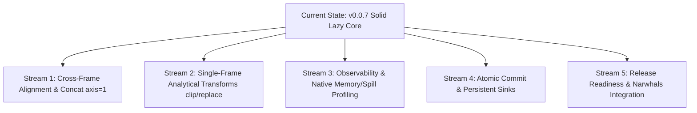

# DuckPD implementation roadmap

DuckPD should be built as a **lazy relational DataFrame with a deliberately
bounded pandas-compatible API**, backed by DuckDB. It should not claim that
arbitrary pandas programs can run unchanged.

This plan favors a standalone implementation over a Modin backend. Modin's
API/compiler/executor layering is useful precedent, but its partition and
distributed-execution machinery is not needed for one DuckDB query plan.

Competitive research, implementation references, and the measurable definition
of "beat FireDucks" live in
[`docs/references/competitive-landscape.md`](references/competitive-landscape.md).

## Product contract

### Promises

- Pandas-shaped `DataFrame`, `Series`, `GroupBy`, indexing, and expression APIs.
- Lazy transformations: public transformation methods build immutable plans.
- Explicit execution through `collect()`, bounded previews, streaming readers,
  direct file/table sinks, or persistence.
- No silent full-frame fallback to pandas.
- Index, row identity, and ordering are explicit metadata, not assumptions.
- Unsupported operations and unsupported argument combinations fail before a
  query starts.
- Direct writes never pass through a pandas DataFrame.
- Larger-than-memory behavior is tested, while DuckDB's documented spill
  limitations remain visible to users.

### Initial non-goals

- Drop-in compatibility with arbitrary pandas code.
- MultiIndex or duplicate displayed column labels.
- Arbitrary row-wise `apply(axis=1)`.
- Python `object` dtype compatibility beyond a documented safe subset.
- Positional operations when stable ordering is unknown.
- Implicit mutation of source files or remote tables.
- A proprietary delta-log or lakehouse storage format.
- Distributed execution, Ray, or Dask.
- Universal remote SQL pushdown in the first release.

## Version and support baseline

Confirm these in an architecture decision record before publishing the first
package:

- [x] Use Python 3.11+ for the first release.
- [x] Use one pandas minor line as the semantic oracle; start with pandas 3.0.
- [x] Develop against DuckDB 1.5, with upper bounds until compatibility CI
      proves the next minor version.
- [x] Make pandas and DuckDB required dependencies.
- [x] Decide whether PyArrow is required or an `arrow` extra. Requiring it is
      recommended for the first release because streaming is a core promise.
- [x] Confirm that the `duckpd` distribution name is available on PyPI.
- [x] Support Linux, macOS, and Windows in CI on Python 3.11 through 3.14.

## v0.1 acceptance workflow

The alpha is useful when this runs lazily and matches pandas for the supported
arguments:

```python
import duckpd as pd

orders = pd.read_parquet(
    "orders/*.parquet",
    index="order_id",
    order_by=["created_at", "order_id"],
)

monthly = (
    orders[orders["status"] == "paid"]
    .assign(
        month=lambda frame: frame["created_at"].dt.to_period("M"),
        net_amount=lambda frame: frame["amount"] - frame["refund_amount"],
    )
    .groupby(["month", "customer_id"], as_index=False)
    .agg(
        revenue=("net_amount", "sum"),
        order_count=("order_id", "size"),
    )
    .sort_values(["month", "revenue"], ascending=[True, False])
)

monthly.explain()
preview = monthly.head(20)
result = monthly.collect()
monthly.write_parquet("monthly.parquet")
```

Acceptance conditions:

- [x] No source rows are read before `explain()`, `head()`, `collect()`, or
      `write_parquet()`.
- [x] `head(20)` executes a plan containing `LIMIT 20` and returns at most 20
      rows.
- [x] `collect()` returns a real pandas DataFrame with the documented index,
      labels, order, and dtypes.
- [x] `write_parquet()` executes directly in DuckDB and never constructs a
      pandas DataFrame.
- [x] The result matches an equivalent pandas pipeline on differential test
      fixtures containing nulls, empty inputs, and duplicate index values.
- [x] `explain()` shows the DuckPD logical plan, generated DuckDB SQL, physical
      plan, execution boundaries, and ordering/index guarantees.

## Architecture baseline

```text
duckpd public API
DataFrame / Series / GroupBy / indexers / readers
                    |
                    v
pandas-semantic layer
validation + rewrites + metadata transitions
                    |
                    v
typed immutable logical plan and expression IR
                    |
                    v
DuckDB compiler -> DuckDBPyRelation / DuckDB expressions
                    |
                    v
Session and executor
collect | Arrow batches | table | Parquet | commit
```

### Core invariants

- `DataFrame` is a mutable Python handle to an immutable `FrameState`.
- `Series` is a typed expression bound to a frame lineage, not a vector.
- Every physical column has an internal `ColumnId` independent of its displayed
  label.
- Every plan transformation declares how it changes schema, index, ordering,
  row identity, and source provenance.
- Displayed labels are unique in v0.1. Reject duplicates explicitly.
- An absent index may become a pandas `RangeIndex` at collection, but it is not
  a stable alignment key inside a lazy plan.
- Same-lineage Series expressions combine without joins. Cross-frame
  expressions require compatible explicit indexes or fail.
- Positional and window operations require guaranteed ordering.
- The compiler accepts typed nodes, never user values interpolated into SQL.
- The executor is the only layer allowed to trigger DuckDB output methods.
- Public wrappers do not expose mutable `DuckDBPyRelation` objects as state.

### Initial logical plan

- [x] `Scan` for Parquet, DuckDB tables, SQL subqueries, pandas, and Arrow.
- [x] `Project` for selection, assignment, rename, cast, and expression output.
- [x] `Filter`.
- [x] `Aggregate` for global reductions and grouped aggregations (`GroupBy.agg`).
- [x] `Join` for DataFrame merges (`DataFrame.merge`) and index joins (`DataFrame.join`).
- [x] `Sort`.
- [x] `Limit`.
- [x] `Union` for row-wise concatenation.
- [x] `Window`.
- [ ] `MaterializedScan` for persisted intermediates.

Keep writes as executor sinks rather than relational nodes until a concrete
optimizer need proves otherwise.

### Initial expression IR

- [x] `ColumnRef(ColumnId)` and `Literal`.
- [x] Unary, binary, and boolean expressions.
- [x] `Function`, `Case`, and `Cast`.
- [x] `AggregateExpression` for global reductions.
- [x] `WindowExpression` with partition, order, and frame metadata.
- [ ] Typed aliases and nullability.

### Frame metadata

- [x] `Schema`: internal IDs, displayed labels, DuckDB type, pandas dtype,
      nullability, and hidden/visible state.
- [x] `IndexSpec`: absent/deferred range index or explicit index columns,
      uniqueness state, and names.
- [x] `OrderSpec`: unknown or guaranteed ordered keys, directions, null
      placement, and stability.
- [ ] `RowIdentity`: stable hidden ordinals are implemented for pandas and
      Arrow snapshots, row-wise unions synthesize stable source/row ordinals,
      and persistence retains identity columns. Join identity and externally
      keyed source identity remain incomplete.
- [ ] `SourceProvenance`: source kind, location, fingerprint, write capability,
      and transformations that preserve source rows.
- [x] `FrameState`: plan, schema, index, order, row identity, provenance, and
      owning session.

### Proposed package layout

```text
src/duckpd/
    __init__.py
    frame.py
    series.py
    groupby.py
    indexing.py
    accessors.py
    io.py
    session.py
    options.py
    errors.py
    logical/
        expressions.py
        plans.py
        metadata.py
        types.py
        rewrites.py
    compiler/
        duckdb.py
        quoting.py
    execution/
        executor.py
        results.py
        sinks.py
        commit.py
tests/
    unit/
    differential/
    integration/
    execution/
    property/
```

Do not create every module up front. Add each module with the first behavior it
owns.

## Implementation phases

### Phase 0: repository and decisions

Goal: establish the contract and a repeatable development environment.

- [x] Add `pyproject.toml` using a `src` layout and a small build backend.
- [x] Manage environments and commands with `uv`.
- [x] Add runtime dependencies and a `dev` dependency group.
- [x] Configure Ruff, Pyright, pytest, coverage, and pre-commit.
- [x] Add CI for lint, type checking, unit tests, and package builds.
- [x] Add optional Make targets for setup, focused checks, the complete quality
      gate, demo smoke runs, builds, release validation, and cleanup.
- [x] Enforce Ruff formatting in pre-commit and CI.
- [x] Add package classifiers, project URLs, and the PEP 561 typed-package
      marker.
- [x] Organize project documentation under `docs/`, add a documentation index,
      and retain conventional root-level project files.
- [x] Add `CONTRIBUTING.md`, a changelog, and architecture decision records.
- [x] Record explicit decisions for:
  - eager `head()` versus lazy `limit()`;
  - `collect()` and `to_pandas()` aliases;
  - implicit module-level sessions and their lifetime;
  - `DataFrame` construction from Python data;
  - behavior of `len`, `shape`, `repr`, and scalar reductions;
  - absent index versus explicit index behavior;
  - default unsupported-operation policy;
  - dependency/version support.
- [x] Recommended API decision: make `limit()` lazy, make `head()` a bounded
      eager pandas preview, and make `repr` plan-focused so display does not
      unexpectedly scan remote data.
- [x] Define exception classes such as `UnsupportedOperationError`,
      `UnorderedOperationError`, `AlignmentError`, `MaterializationError`, and
      `ConcurrentModificationError`.

Exit gate:

- [x] `uv sync`, `uv run pytest`, `uv run ruff check .`,
      `uv run ruff format --check .`, `uv run pyright`, and `uv build` pass in
      a clean checkout.

### Phase 1: walking vertical slice

Goal: prove the complete lazy path before broadening the API.

- [x] Implement `Session` as the owner of one DuckDB connection, configuration,
      registered Python/Arrow sources, temporary objects, and cleanup.
- [x] Support `memory_limit`, `temp_directory`, maximum temporary size,
      `threads`, and read-only mode where applicable.
- [x] Implement the initial metadata objects and immutable plan/expression
      dataclasses.
- [x] Implement `DuckDBCompiler.compile_plan()` and `compile_expression()`.
- [x] Prefer DuckDB's relation and expression APIs. Use a contained SQL path
      only for features those APIs cannot express, with centralized identifier
      quoting and literal handling.
- [x] Implement `DataFrame` and `Series` wrappers with lineage validation.
- [x] Implement `read_parquet()`, `from_pandas()`, `from_arrow()`,
      `Session.table()`, and `Session.sql()`.
- [x] Implement column selection, list projection, scalar arithmetic,
      comparisons, boolean expressions, filtering, `assign()`, `sort_values()`,
      and lazy `limit()`.
- [x] Implement `collect()`, bounded `head()`, `to_arrow()`,
      `to_arrow_batches()`, `write_parquet()`, and `explain()`.
- [x] Add an executor event hook or counter so tests can prove transformations
      do not execute.
- [x] Retain references to registered pandas/Arrow sources for the complete
      lifetime of any dependent plan.
- [x] Ensure closed sessions produce a clear error instead of a dangling
      DuckDB failure.

Exit gate:

- [x] A Parquet scan can be filtered, projected, sorted, previewed, collected,
      streamed, explained, and written through one lazy plan.
- [x] Unit tests prove all non-sink calls leave the execution counter at zero.
- [x] Inputs containing quoted identifiers and hostile string values compile
      safely and return correct results.

### Phase 2: schema, dtype, null, index, and order semantics

Goal: make metadata trustworthy before implementing many methods.

- [ ] Define the complete supported DuckDB-to-pandas dtype matrix. The initial
      reduction matrix now covers DuckDB boolean, signed/unsigned integer,
      floating, and decimal inputs; temporal, string, binary, nested, and
      nullable-extension output policies remain open.
- [ ] Initially cover booleans, signed/unsigned integers, floats, strings,
      binary, decimal, date, timestamp, timezone-aware timestamp, and interval.
- [ ] Decide nullable dtype output policy and test `pd.NA`, `NaN`, `NaT`, and
      SQL `NULL` separately.
- [ ] Treat nested DuckDB types as documented extension values or reject them
      until their pandas representation is stable.
- [x] Implement displayed-label lookup through internal column IDs.
- [x] Keep hidden index and ordering columns available through projections.
- [x] Implement metadata transition functions for every existing plan node.
- [x] Add DuckPD-owned expression metadata inspired by Narwhals:
      elementwise, preserves-length, scalar-like, literal, windowed,
      order-dependent, and static/multi-output expansion state.
- [x] Use expression metadata to validate broadcasting, window rewrites,
      assignment length, and operations that require an explicit order.
- [x] Implement explicit `set_index()` and `reset_index()` without assuming
      uniqueness.
- [x] Add `order_by=` declarations at data-source boundaries.
- [x] Reject order-dependent methods when `OrderSpec` is unknown.
- [ ] Define collection behavior for absent, explicit, duplicate, named, and
      null-containing indexes.
- [ ] Define Series behavior after the parent DataFrame handle is reassigned;
      recommended: the Series remains bound to the immutable state from which
      it was created.
- [x] Ensure metadata inspection does not accidentally execute row-producing
      queries.

Exit gate:

- [x] Metadata unit tests cover every plan node and cannot leave dangling
      index/order column IDs.
- [ ] Differential tests match pandas for supported dtype/null/index cases.

### Phase 3: core single-frame pandas API

Goal: cover common analytical transformations that do not require alignment.

- [x] `rename`, `drop`, `astype`, `fillna`, `dropna`, `isna`, `notna`, `where`,
      and `mask`.
- [x] `rename` and `drop` for column labels with `errors`, `axis`, and `columns`
      keyword support; index renaming and row dropping remain unsupported.
- [x] `astype` for Series and DataFrame supporting string/pandas/DuckDB dtype mappings.
- [x] `fillna` for Series and DataFrame supporting scalar and column-mapping dicts.
- [x] `dropna` for Series (axis=0) and DataFrame with `how='any'/'all'`, `subset`, and `thresh`.
- [x] `where` and `mask` for Series and DataFrame with `cond` and `other` expressions.
- [x] Scalar and Series arithmetic, comparisons, boolean operations, and casts.
- [x] Reductions: `count`, `size`, `sum`, `mean`, `min`, `max`, `std`, `var`,
      `median`, `quantile`, `any`, and `all`.
- [x] Implement eager `count`, `size`, `sum`, `mean`, `min`, `max`, `std`, `var`,
      `median`, `quantile`, `any`, and `all` reductions for Series and
      column-wise DataFrame over numeric and boolean data.
- [x] Match pandas 3.0 for `skipna`, `min_count`, `ddof`, `bool_only`, empty,
      all-null, boolean, numeric, and hidden-index cases.
- [x] Propagate basic numeric expression types through `assign()` so assigned
      arithmetic columns can be reduced without collecting.
- [x] Implement pandas-specific reduction semantics, including `skipna`,
      `min_count`, `ddof`, empty inputs, and all-null inputs.
- [x] `drop_duplicates` with `keep="first"`, `keep="last"`, and `keep=False`
      using explicit ordering and window rewrites.
- [x] `value_counts`, `nunique`, `unique`, `nlargest`, and `nsmallest`.
- [x] `clip(lower, upper)` for Series and DataFrame via bounded `CASE WHEN` compilation.
- [x] `replace(to_replace, value)` for Series and DataFrame scalar, list, and dictionary value replacements.
- [ ] `sample` only after defining deterministic seed and ordering behavior.
- [x] Reject unsupported axes, argument combinations, and reduction dtypes
      before execution for the implemented reduction subset.
Exit gate:

- [ ] Every method has differential tests for ordinary, null, empty, and
      duplicate-value cases.
- [ ] Plan tests verify that streaming operations remain a single DuckDB query.

### Phase 4: GroupBy and aggregation

Goal: support the most valuable analytical workflow with pandas semantics.

- [x] Implement `DataFrame.groupby()` and `DataFrameGroupBy` wrapper with
      named aggregation (`agg(new_name=("col", "func"))`).
- [x] Support `as_index=True/False`, `sort=True/False`, and `dropna=True/False`
      in `GroupBy.agg`.
- [x] Support core aggregate functions: `sum`, `mean`, `min`, `max`, `count`, `size`.
- [x] Support dict and function-name string aggregation forms in `GroupBy.agg`.
- [x] Support `DataFrameGroupBy` convenience methods (`sum`, `mean`, `min`, `max`, `count`, `size`) and column selection `g['col']` / `g[['col1', 'col2']]`.
- [x] Implement `Series.groupby()` returning `SeriesGroupBy` with `agg`, `sum`, `mean`, `min`, `max`, `count`, `size`, `std`, `var`, `median`.
- [ ] Handle categorical grouping only after `observed` behavior is tested.
- [ ] Before expanding the compiler manually, run the bounded Ibis substrate
      spike defined in the competitive landscape guide and record an ADR with
      generated SQL, semantic gaps, compile cost, and dependency tradeoffs.
- [ ] Defer arbitrary `GroupBy.apply`.

Exit gate:

- [x] GroupBy differential tests cover null keys, multiple keys, named
      aggregations, ordering, and dtype output.

### Phase 5: merge, join, concat, and alignment

Goal: implement cross-frame behavior without pretending SQL joins equal pandas
alignment.

- [x] Implement `merge()` for inner, left, right, outer, and cross joins.
- [x] Support `on`, `left_on`, `right_on`, `left_index`, `right_index`,
      `suffixes`, and `sort` parameters in `merge()`.
- [x] Match pandas null-key behavior explicitly (`IS NOT DISTINCT FROM` in SQL
      joins so null matches null as in pandas).
- [x] Implement `join()` on top of the same semantic merge operation.
- [x] Implement `validate=` cardinality checks as explicit validation queries.
- [x] Implement `concat(axis=0)` with schema reconciliation and stable source
      order.
- [x] Implement `concat(axis=1)` as index-aligned full outer join with column collision suffix management.
- [ ] Implement arithmetic between frames as index alignment joins only when
      both sides have compatible explicit indexes.
- [ ] Reject ambiguous alignment rather than falling back to position.
Exit gate:

- [x] Differential tests cover duplicate keys, null keys, unmatched rows,
      suffix collisions, index names, and output order.

### Phase 6: ordering, indexing, and windows

Goal: add positional and order-sensitive behavior only on sound foundations.

- [x] Implement label-based `.loc` reads for explicit indexes.
- [x] Implement a documented subset of `.iloc` reads when stable order exists.
- [x] Implement positional slicing through row-number windows.
- [x] Implement `shift`, `diff`, `pct_change`, `cumsum`, `cummin`, `cummax`, and
      `cumprod`.
- [x] Implement `rank` methods with pandas tie, null, percentage, and ascending
      behavior.
- [x] Extend `drop_duplicates` to support `keep='last'` and `keep=False` via
      window row numbers and counts.
- [x] Implement expanding and rolling `count`, `sum`, `mean`, `min`, `max`,
      `std`, and `var` for row-based windows first.
- [ ] Add time-based rolling windows only after timezone and closed-boundary
      semantics are specified.
- [x] Track when joins, aggregates, unions, and materialization destroy or
      establish order guarantees.

Exit gate:

- [ ] Every positional/window test fails with `UnorderedOperationError` when
      the same fixture is loaded without `order_by=`.
- [ ] Ordered cases match pandas with duplicate sort keys and nulls.

### Phase 7: string, datetime, and categorical accessors

Goal: cover high-use vectorized accessors without opening arbitrary Python
execution.

- [x] Add `Series.str` methods backed by DuckDB string functions:
      `upper()`, `lower()`, `strip()`, `len()`, `startswith()`, `endswith()`,
      `contains()`, `replace()`.
- [x] Add `Series.dt` fields (`year`, `month`, `day`, `hour`, `minute`, `second`, `date`),
      `strftime()`, and `to_period()` representation.
- [ ] Add timezone operations and floor/ceil/round after timedelta semantics are specified.
- [ ] Add a limited categorical representation and `.cat` only after category
      order and unused-category metadata can be preserved.
- [x] Add differential tests for Unicode, empty strings, nulls, and format patterns.

Exit gate:

- [x] The v0.1 acceptance workflow's monthly period expression matches pandas.

### Phase 8: execution, persistence, and observability hardening

Goal: make execution boundaries safe and explainable.

- [x] Implement `to_pandas()`, `to_arrow()`, `to_arrow_batches()`, and optional
      pandas-batch iteration with explicit memory behavior.
- [x] Implement `persist()` to temporary and named DuckDB tables.
- [x] Implement `save_as_table()` and append behavior with schema validation.
- [x] Implement direct CSV and Parquet sinks using relation writers or
      `COPY (query) TO`; request `RETURN_STATS` where a report is needed.
- [ ] Keep sink paths and options parameterized or safely escaped.
- [x] Add `explain(mode="logical" | "sql" | "physical" | "all")`.
- [ ] Add an optimized logical-plan view with named rewrite passes and
      before/after plan snapshots.
- [ ] Implement required-column analysis, projection/predicate pushdown,
      limit/top-k pushdown, and redundant project/sort elimination where these
      add pandas-semantic knowledge beyond DuckDB's optimizer.
- [ ] Add liveness and common-subplan analysis; recommend explicit `persist()`
      before considering automatic cache insertion.
- [x] Add `profile()` using DuckDB's structured JSON profiling. Report plan
      build, compile, operator, I/O, spill, conversion, and total timings.
- [ ] Support machine-readable profile output and optional Chrome Trace Event
      JSON without parsing DuckDB's human-readable plan text.
- [ ] Add a benchmark context that forces complete execution without disabling
      normal optimization, and separates planning, execution, and conversion.
- [x] Add `explain_write()` with strategy, estimated scan, blocking operators,
      ordering guarantees, spill configuration, and expected extra disk use.
- [ ] Mark estimates as estimates and avoid executing full counts merely to
      populate an explanation.
- [ ] Detect known non-spillable operations such as large `list` or
      `string_agg` states and warn or reject under strict resource policy.
- [ ] Consider persisted stages when a plan contains several large blocking
      operators; require benchmark evidence before adding automatic staging.
- [ ] Ensure errors include the DuckPD operation and plan context without
      leaking credentials.

Exit gate:

- [x] A generated data test larger than the configured memory budget completes
      with a configured spill directory and measured bounded process memory.
- [x] Augment benchmark reporting and `test_execution_limits.py` to capture true
      process peak RSS (`getrusage`/`/proc/self/status`) and verify DuckDB temporary
      spill file generation during constrained-memory sorts and joins.
- [ ] Confirm the Windows peak-working-set sampler returns non-zero RSS on
      `windows-latest`; the implementation uses `GetProcessMemoryInfo`, but the
      bounded-RSS assertion remains skipped if the platform sampler returns `0`.
- [x] A test forbids pandas conversion methods during every direct sink.

### Phase 9: lazy mutation and safe local commit

Goal: make pandas-shaped assignment mutate only the Python plan until an
explicit sink is called.

- [x] Implement `DataFrame.__setitem__` by replacing the handle's `FrameState`
      with a new `Project` plan.
- [x] Implement a narrow `.loc[mask, column] = value` as a `Case` expression.
- [x] Initially require assignments to be row-preserving and reject schema or
      index ambiguities.
- [ ] Define copy and alias behavior for two DataFrame handles sharing one
      immutable state.
- [x] Implement `commit()` only for a single writable local Parquet source in
      the first iteration.
- [x] Capture source path, size, modification time, and optional content hash.
- [x] Write to a unique staging file in the destination directory.
- [ ] Collect DuckDB `COPY` row/file/column statistics without collecting rows.
- [x] Validate schema, expected row-preservation, output readability, and
      source fingerprint.
- [x] Atomically replace the source with `os.replace()` only after validation.
- [x] Support retaining the previous version and return a structured report.
- [ ] Add failure injection at each commit step and prove the original remains
      readable before atomic replacement.
- [x] Add a process-level lock or explicitly document single-writer behavior
      before claiming concurrency safety. The initial implementation documents
      single-writer operation and does not claim locking against unrelated writers.
- [ ] Add partition-aware rewrites only after full-file commit is reliable.

Exit gate:

- [ ] Assignment performs zero I/O until a sink.
- [ ] A 100 GB-equivalent generated workload can be rewritten with memory tied
      to active batches/operator state rather than result size.
- [x] Concurrent source modification raises `ConcurrentModificationError` and
      does not replace the source.

### Phase 10: controlled Python functions and fallback policy

Goal: offer explicit escape hatches without violating the product's memory
promise.

- [ ] Default unsupported behavior to `fallback="error"`.
- [ ] Add an explicit Arrow UDF registration API with declared input/output
      types, null handling, exception behavior, determinism, and side effects.
- [ ] Allow batch fallback only for operations proven independent by batch.
- [ ] Consider `collect_small` only with a trustworthy estimate, a strict byte
      limit, and explicit opt-in.
- [ ] Include fallback boundaries and estimated transfer/materialization in
      `explain()`.
- [ ] Emit a structured reason and estimated/actual bytes for every explicit
      materialization or fallback boundary; profiling must never hide one.
- [ ] Never use DuckDB relation `map()` as an invisible pandas fallback.
- [ ] Test that unsupported operations fail before any source scan.

Exit gate:

- [ ] No public operation can materialize an unbounded pandas object without an
      explicit materialization call or opt-in policy.

### Phase 11: object storage and remote databases

Goal: broaden sources after local semantics are stable.

- [ ] Support HTTP/S3/GCS Parquet through DuckDB configuration and secrets.
- [ ] Test projection, predicate, and row-group pruning with `EXPLAIN ANALYZE`.
- [ ] Support attached PostgreSQL, MySQL, and SQLite as DuckDB scans first,
      while clearly reporting where computation occurs.
- [ ] Introduce `SourceCapabilities` for projection, filter, aggregation, join,
      window, limit, and sort pushdown.
- [ ] Add a backend-neutral source fragment to the IR before implementing a
      split planner.
- [ ] Compile supported fragments to source-native SQL, stream reduced results
      through Arrow, and finish unsupported work in DuckDB.
- [ ] Add cost and safety guards against unexpectedly large network scans.
- [ ] Redact credentials and secrets from plans, logs, exceptions, and reprs.
- [ ] Use versioned object paths plus a manifest/catalog for remote replacement;
      do not claim atomic rename semantics on object stores.
- [ ] Delegate recurring row-level updates to DuckDB, Iceberg, or DuckLake
      tables instead of inventing a storage log.

Exit gate:

- [ ] Integration tests prove which operators execute remotely and measure
      transferred bytes for representative pipelines.
- [ ] Cross-source joins have explicit movement plans visible in `explain()`.

### Phase 12: release quality

Goal: publish a narrow, honest, measurable API.

- [ ] Maintain a machine-readable compatibility matrix by method, arguments,
      dtype coverage, ordering requirement, and release version.
- [ ] Generate user-facing compatibility documentation from that matrix.
- [ ] Add API docs, tutorials, architecture docs, and unsupported-operation
      guidance.
- [ ] Add benchmarks for compile time, execution time, peak RSS, spill bytes,
      and bytes transferred from remote sources.
- [ ] Add reproducible db-benchmark GroupBy/join, TPC-H, and synthetic OHLC
      tracks with result validation, pinned environments, and cold/warm runs.
- [ ] Compare supported workflows against pandas, direct DuckDB SQL, Polars,
      and FireDucks where available; record unsupported/OOM outcomes instead of
      omitting them.
- [ ] Track the competitive scorecard for correctness, safety, scale,
      observability, performance, portability, interoperability, and openness.
- [x] Add small, medium, and larger-than-memory benchmark datasets generated
      deterministically rather than checked into Git.
- [ ] Add package build/install smoke tests and verify wheels with the supported
      Python matrix.
- [ ] Add artifact-content checks for wheel/sdist metadata, required package
      files such as `py.typed`, and exclusion of caches, generated data, and
      secrets.
- [ ] Install the built wheel in a clean environment and run an import, version,
      and minimal in-memory DuckPD pipeline smoke test.
- [ ] Require release tags, package metadata, and changelog versions to match
      before PyPI Trusted Publishing runs.
- [ ] After index/order semantics and the public API stabilize, prototype an
      optional Narwhals compliance layer or plugin so `nw.from_native()` can
      wrap DuckPD as a `LazyFrame` without collecting.
- [ ] Require Narwhals interoperability tests to prove `to_native()` returns a
      DuckPD frame, transformations remain lazy, and execution stays in DuckDB.
- [ ] Publish a pre-release and collect real unsupported-operation traces only
      with explicit user consent and no query data.
- [x] Define the pre-`1.0` versioning, deprecation, and immutable-release policy.
- [x] Add a manual `make publish` workflow that tests, bumps the patch version,
      rebuilds clean artifacts, and publishes through `uv`.

Exit gate:

- [ ] The documented v0.1 matrix is fully tested, examples run in CI, package
      artifacts install cleanly, and unsupported behavior is explicit.

## First PR-sized increments

Implement in this order. Each increment should be independently testable.

1. [x] Project scaffold, `uv`, quality tools, CI, and version policy.
2. [x] Session lifecycle plus Parquet/pandas/Arrow source registration.
3. [x] Typed expressions, minimal plans, metadata, and compiler skeleton.
4. [x] `DataFrame`, `Series`, selection, arithmetic, filtering, and `assign`.
5. [x] `collect`, `head`, Arrow batches, direct Parquet write, and `explain`.
6. [x] Index/order declarations and metadata transition test suite.
7. [x] Initial numeric/boolean null and dtype semantics plus basic `count`,
       `size`, `sum`, `mean`, `min`, and `max` reductions. Broader dtype policy
       and advanced reductions remain in Phases 2 and 3.
   - [x] Add a runnable reduction showcase covering `numeric_only`, `skipna`,
         `min_count`, hidden indexes, assigned expressions, and explicit
         execution counts in `demo/reduction_pipeline.py`.
8. [x] Initial `GroupBy.agg` with pandas semantic rewrites (`as_index`, `sort`,
       `dropna`, named aggregation, and null/dtype handling).
9. [x] Initial `DataFrame.merge` and `DataFrame.join` with pandas null-key
       matching, `suffixes`, `how` modes, and index joins. Concat and frame
       alignment remain in Phase 5.
10. [x] String and datetime accessors (`Series.str` and `Series.dt`) supporting
       the v0.1 acceptance workflow and common analytical transforms.
11. [x] Resource-limit, spill-directory configuration, and larger-than-memory
       integration tests with `explain(mode=...)` and `explain_write()`.
12. [x] Direct-sink zero-materialization verification, streaming Arrow batches,
       and extended relational `.loc` label-list reindexing.
13. [x] Column-wise concatenation (`concat(axis=1)`) via index-aligned full
       outer joins and cross-frame arithmetic on compatible explicit indexes.
14. [x] Single-frame analytical cleaning transforms: `clip(lower, upper)` and
       `replace(to_replace, value)` for Series and DataFrame.
15. [x] Structured profiling (`df.profile()`) exposing DuckDB operator and I/O
       timings, plus native process RSS and DuckDB spill byte metrics in
       benchmarks and execution limits.
   - [ ] Confirm the Windows `GetProcessMemoryInfo` sampler returns non-zero RSS
         under `windows-latest` so the bounded-RSS assertion cannot skip.
16. [x] Local Parquet atomic `commit()` workflow (staging file, validation,
       atomic `os.replace`) and persistent DuckDB table sinks (`save_as_table`).
17. [ ] Narwhals lazy frame compliance plugin prototype, compatibility matrix
       documentation generation, and clean wheel build/install smoke test across
       the Python 3.11–3.14 matrix.

### Active workstreams and immediate next priorities



1. **Stream 1: Cross-Frame Alignment & `concat(axis=1)` (Phase 5)**
   - Implement `duckpd.concat(objs, axis=1)` via index-aligned full outer joins with column collision suffix management (`_x`, `_y` or caller-provided).
   - Implement cross-frame arithmetic (`df1 + df2`, `s1 + s2`) aligning lazily on explicit compatible indexes (`IndexSpec`).
2. **Stream 2: High-Value Analytical Transformations (Phase 3)**
   - `clip(lower, upper)` for Series and DataFrame via bounded `CASE WHEN` expression compilation.
   - `replace(to_replace, value)` for scalar, list, and dictionary value replacements.
   - [x] `sample(n=..., frac=..., random_state=...)` row sampling with deterministic seed behavior.
3. **Stream 3: Observability & Memory Profiling (Phase 8)**
   - `df.profile()` exposes DuckDB structured JSON profiling (operator timings, spill, I/O).
   - Benchmark and execution-limit tests capture isolated RSS and verify DuckDB spill bytes.
   - Follow-up: confirm non-zero Windows peak-working-set sampling in Windows CI.
4. **Stream 4: Atomic Commit & Persistent Sinks (Phases 8 & 9) [Completed]**
   - Local Parquet atomic `commit()`: staging file -> validate row count/schema/fingerprint -> atomic `os.replace`.
   - Persistent DuckDB sinks: `save_as_table(name, mode="overwrite"|"append")`.
5. **Stream 5: Ecosystem & Release Readiness (Phase 12)**
   - Prototype Narwhals compliance layer so `nw.from_native()` accepts DuckPD DataFrames without eager collection.
   - Run clean wheel build & install smoke tests across Python 3.11–3.14 matrix for v0.1.0 release tagging.

Do not begin broad accessor coverage, mutable assignment, or remote split
planning before increment 6 proves metadata transitions are reliable.
## Definition of done for each public operation

- [ ] Public signature and supported arguments are documented.
- [ ] Unsupported arguments raise a specific error before execution.
- [ ] The operation builds typed IR without executing.
- [ ] Schema, index, ordering, row identity, and provenance transitions are
      tested.
- [ ] DuckDB compiler tests cover identifiers, literals, and null behavior.
- [ ] Differential tests compare against pandas on normal, empty, null, and
      duplicate cases.
- [x] Property tests are added when combinations are too broad for a small
      parameter matrix.
- [ ] Execution tests assert expected pushdown, blocking operators, and query
      count.
- [ ] The compatibility matrix is updated.
- [ ] User-facing docs include materialization and ordering behavior where it
      differs from pandas.

## Test strategy

### Unit tests

- IR construction and immutability.
- Expression type inference.
- Metadata transitions.
- Compiler output and safe quoting.
- Session ownership and cleanup.
- Argument validation and error messages.

### Differential tests

Run the same supported pipeline against DuckPD and the pinned pandas oracle,
then compare with `pandas.testing` after normalizing only documented dtype
differences.

Fixtures should systematically include:

- Empty frames and empty groups.
- Nulls in values, index columns, sort keys, and join keys.
- Duplicate values and duplicate index keys.
- Negative, zero, overflow-adjacent, infinite, and NaN numeric values.
- Unicode and empty strings.
- Naive and timezone-aware datetimes around daylight-saving transitions.
- Stable and unstable ordering situations.

Mine risky combinations from the FireDucks release-note catalogue, then derive
original minimal cases and validate them against the pinned pandas oracle.
Prioritize result dtypes, null comparisons, GroupBy options/order, merge/index
shape and names, duplicate/non-string labels, rolling/rank, and memory lifetime.

### Property tests

- Generate small typed frames and operation sequences with Hypothesis.
- Compare only operations declared compatible in the matrix.
- Persist minimal failing examples as regression tests.
- Keep randomized tests deterministic in CI.

### Execution tests

- Assert transformations do not call executor output methods.
- Assert `head(n)` introduces a limit.
- Assert projection and filters reach Parquet scans.
- Assert one user pipeline normally compiles to one DuckDB query.
- Assert direct sinks never call pandas conversion.
- Assert resource settings reach the DuckDB connection.
- Assert secrets never appear in plans or errors.

### Larger-than-memory tests

- Generate data during the test; do not store giant fixtures.
- Run with a deliberately low `memory_limit` and isolated spill directory.
- Cover sort, aggregate, join, and window workloads separately.
- Keep a slower combined-blocking-operator suite outside normal PR CI.
- Record peak RSS, spill bytes, completion, and cleanup.
- Treat DuckDB's memory limit as a working-memory setting, not an exact RSS cap.

## Decisions intentionally deferred

- Reusing Modin's public API wrappers versus remaining standalone. Revisit only
  if maintaining signatures becomes more expensive than integrating Modin.
- SQLGlot or another dialect library for source-native SQL. It is unnecessary
  until a split planner exists.
- Duplicate column labels and MultiIndex.
- Automatic cardinality estimation for safe fallback.
- Automatic persisted stages for complex spill plans.
- Iceberg/DuckLake write APIs.
- A plugin API for third-party execution backends.
- Ibis as a compiler substrate. Decide by ADR after the bounded GroupBy/join/
      window spike; DuckPD retains ownership of its public IR and pandas semantic
      metadata either way.
- Narwhals interoperability. Defer implementation until DuckPD's index/order
      metadata and lazy public API are stable; the Narwhals extension mechanism is
      currently experimental.

Narwhals is not planned as DuckPD's internal IR, SQL compiler, dtype authority,
or primary test oracle. It exposes Polars-style semantics, already supports raw
DuckDB relations, and its DuckDB equality helper intentionally ignores row
order. DuckPD must retain its pandas-specific index, alignment, ordering, null,
and mutation rewrites. Reuse the expression-metadata concepts and add optional
ecosystem compatibility later.

## Current evidence

Checked against current documentation on 2026-08-14:

- DuckDB 1.5 relations are symbolic and lazy until an output method is called.
- The relation API exposes projection, filtering, aggregation, joining,
  ordering, limits, SQL extraction, and physical explanation.
- The expression API provides structured columns, constants, cases, functions,
  casts, null checks, and ordering modifiers.
- `to_arrow_reader()` streams Arrow record batches.
- Relation Parquet writers and `COPY (query) TO` write without pandas;
  `COPY` can return file and column statistics and use temporary output files.
- DuckDB spills grouping, joins, sorting, and windows, with documented limits
  for multiple blocking operators and some aggregate states.
- Current releases observed were DuckDB 1.5.5 and pandas 3.0.5.
- Narwhals 2.24 wraps `DuckDBPyRelation` as a lazy frame and returns the native
      relation from `to_native()`. It does not currently recognize DuckPD frames
      without a compliance hook or plugin.

Primary references:

- [Competitive landscape and implementation references](references/competitive-landscape.md)

- https://duckdb.org/docs/current/clients/python/relational_api.html
- https://duckdb.org/docs/current/clients/python/expression.html
- https://duckdb.org/docs/current/guides/python/export_arrow.html
- https://duckdb.org/docs/current/sql/statements/copy.html
- https://duckdb.org/docs/current/guides/performance/how_to_tune_workloads.html
- https://modin.readthedocs.io/en/stable/development/architecture.html
- https://pandas.pydata.org/docs/development/contributing_codebase.html
- https://narwhals-dev.github.io/narwhals/how_it_works/
- https://narwhals-dev.github.io/narwhals/extending/
- https://narwhals-dev.github.io/narwhals/api-reference/testing/